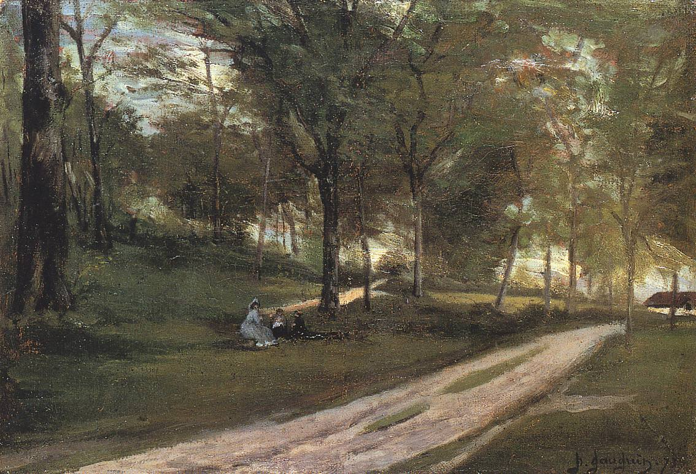

[🏠 Home](../../index.md)

# March 1

## 🧑‍🎨 Painting of the day

[Paul Gauguin](http://en.wikipedia.org/wiki/Paul_Gauguin) (Symbolism, Post-Impressionism)

<button class="btn btn-success"
onclick=" window.open('https://lens.google.com/uploadbyurl?url=https://iretes.github.io/one-a-day/data/img/Paul_Gauguin_1.jpg','_blank')">
Search with Google Lens
</button>

## 🎼 Song of the day

> *In the Still of the Night*
by The Five Satins

 Written by Fred Parris.

Released in Sept. , 1956.

<button class="btn btn-success"
onclick=" window.open('http://www.youtube.com/search?q=In the Still of the Night by The Five Satins','_blank')">
Search on YouTube
</button>

## 🏛️ UNESCO heritage site of the day

> *Los Alerces National Park*, Argentina

The Los Alerces National Park is located in the Andes of northern Patagonia and its western boundary  coincides with the Chilean border. Successive glaciations have moulded the landscape in the region creating spectacular features such as moraines, glacial cirques and clear-water lakes. The vegetation is dominated by dense temperate forests, which give way to alpine meadows higher up under the rocky Andean peaks. A highly distinctive and emblematic feature is its alerce forest; the globally threatened Alerce tree is the second longest living tree species in the world (&gt;3,600 years). The Alerce forest in the property is in an excellent state of conservation. The property is vital for the protection of some of the last portions of continuous Patagonian Forest in an almost pristine state and is the habitat for a number of endemic and threatened species of flora and fauna.

<button class="btn btn-success"
onclick=" window.open('http://www.google.com/search?q=Los Alerces National Park','_blank')">
Search on Google
</button>

## 🗺️ Place of the day

<iframe
src="https://www.mapcrunch.com"
name="mapcrunch"
width="500"
height="500"
allowTransparency="true"
scrolling="no"
frameborder="0"
>
</iframe>
## 🎨 Color of the day

> *[Medium turquoise](https://en.wikipedia.org/wiki/Turquoise_(color)#Medium_turquoise)*

&#9632;

## 🌿 Plant of the day

> *hen plant*

<button class="btn btn-success"
onclick=" window.open('http://www.google.com/search?q=hen plant','_blank')">
Search on Google
</button>

## 🧑‍🔬 Scientific discovery of the day

> *1905: Albert Einstein: theory of special relativity, explanation of Brownian motion, and photoelectric effect*

<button class="btn btn-success"
onclick=" window.open('http://www.google.com/search?q=1905: Albert Einstein: theory of special relativity, explanation of Brownian motion, and photoelectric effect','_blank')">
Search on Google
</button>

## 💭 Philosophical concept of the day

> *[Concept](https://en.wikipedia.org/wiki/Concept)*

## 🗣️ Saying of the day

> *Paint the town red*

To 'paint the town red' is to engage in a riotous spree.

## 🏳️‍🌈 International day

World Seagrass Day, Zero Discrimination Day.