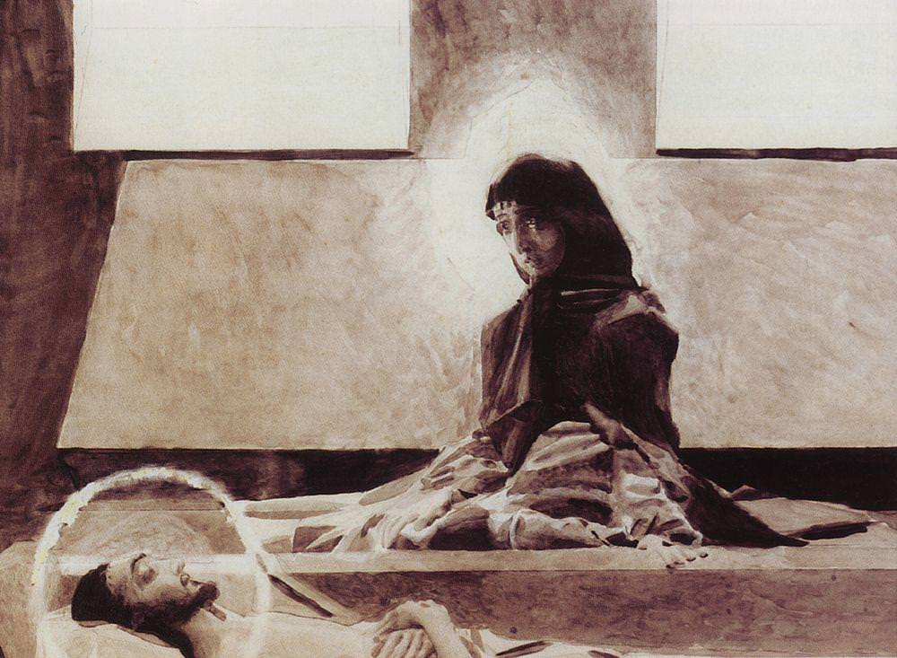

[🏠 Home](../../index.md)

# March 11

## 🧑‍🎨 Painting of the day

[Mikhail Vrubel](http://en.wikipedia.org/wiki/Mikhail_Vrubel) (Symbolism)

<button class="btn btn-success"
onclick=" window.open('https://lens.google.com/uploadbyurl?url=https://iretes.github.io/one-a-day/data/img/Mikhail_Vrubel_6.jpg','_blank')">
Search with Google Lens
</button>

## 🎼 Song of the day

> *You Really Got Me*
by The Kinks

 Written by Ray Davies.

Released in Sept. , 1964.

<button class="btn btn-success"
onclick=" window.open('http://www.youtube.com/search?q=You Really Got Me by The Kinks','_blank')">
Search on YouTube
</button>

## 🏛️ UNESCO heritage site of the day

> *Aldabra Atoll*, Seychelles

The atoll is comprised of four large coral islands which enclose a shallow lagoon; the group of islands is itself surrounded by a coral reef. Due to difficulties of access and the atoll's isolation, Aldabra has been protected from human influence and thus retains some 152,000 giant tortoises, the world's largest population of this reptile.

<button class="btn btn-success"
onclick=" window.open('http://www.google.com/search?q=Aldabra Atoll','_blank')">
Search on Google
</button>

## 🗺️ Place of the day

<iframe
src="https://www.mapcrunch.com"
name="mapcrunch"
width="500"
height="500"
allowTransparency="true"
scrolling="no"
frameborder="0"
>
</iframe>
## 🎨 Color of the day

> *[Taupe](https://en.wikipedia.org/wiki/Taupe)*

&#9632;

## 🌿 Plant of the day

> *crowfoot*

<button class="btn btn-success"
onclick=" window.open('http://www.google.com/search?q=crowfoot','_blank')">
Search on Google
</button>

## 🧑‍🔬 Scientific discovery of the day

> *1749 – 1789: Buffon wrote Histoire naturelle.*

<button class="btn btn-success"
onclick=" window.open('http://www.google.com/search?q=1749 – 1789: Buffon wrote Histoire naturelle.','_blank')"> 
Search on Google
</button>

## 💭 Philosophical concept of the day

> *[Modal logic](https://en.wikipedia.org/wiki/Modal_logic)*

## 🗣️ Saying of the day

> *Balance of power - The *

The
distribution of power between nations in such a way that no single state has dominance
over the others.
