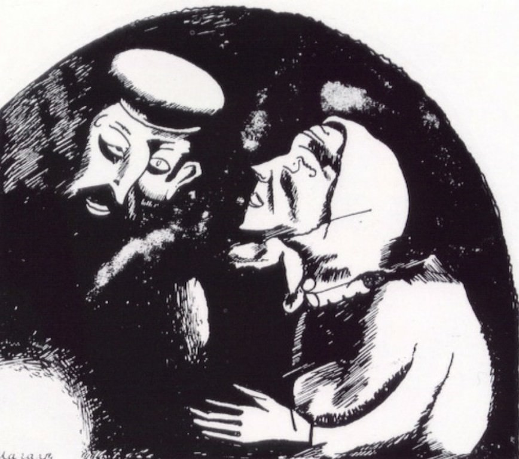

[🏠 Home](../../index.md)

# March 12

## 🧑‍🎨 Painting of the day

[Marc Chagall](http://en.wikipedia.org/wiki/Marc_Chagall) (Primitivism)

<button class="btn btn-success"
onclick=" window.open('https://lens.google.com/uploadbyurl?url=https://iretes.github.io/one-a-day/data/img/Marc_Chagall_5.jpg','_blank')">
Search with Google Lens
</button>

## 🎼 Song of the day

> *Mr. Tambourine Man*
by The Byrds

 Written by Bob Dylan.

Released in May , 1965.

<button class="btn btn-success"
onclick=" window.open('http://www.youtube.com/search?q=Mr. Tambourine Man by The Byrds','_blank')">
Search on YouTube
</button>

## 🏛️ UNESCO heritage site of the day

> *Rock Art of the Mediterranean Basin on the Iberian Peninsula*, Spain

The late prehistoric rock-art sites of the Mediterranean seaboard of the Iberian peninsula form an exceptionally large group. Here the way of life during a critical phase of human development is vividly and graphically depicted in paintings whose style and subject matter are unique.

<button class="btn btn-success"
onclick=" window.open('http://www.google.com/search?q=Rock Art of the Mediterranean Basin on the Iberian Peninsula','_blank')">
Search on Google
</button>

## 🗺️ Place of the day

<iframe
src="https://www.mapcrunch.com"
name="mapcrunch"
width="500"
height="500"
allowTransparency="true"
scrolling="no"
frameborder="0"
>
</iframe>
## 🎨 Color of the day

> *[Silver](https://en.wikipedia.org/wiki/Silver_(color))*

&#9632;

## 🌿 Plant of the day

> *box*

<button class="btn btn-success"
onclick=" window.open('http://www.google.com/search?q=box','_blank')">
Search on Google
</button>

## 🧑‍🔬 Scientific discovery of the day

> *1995: Michel Mayor and Didier Queloz definitively observe the first extrasolar planet around a main sequence star*

<button class="btn btn-success"
onclick=" window.open('http://www.google.com/search?q=1995: Michel Mayor and Didier Queloz definitively observe the first extrasolar planet around a main sequence star','_blank')"> 
Search on Google
</button>

## 💭 Philosophical concept of the day

> *[Object](https://en.wikipedia.org/wiki/Object_(philosophy))*

## 🗣️ Saying of the day

> *We few, we happy few, we band of brothers*

'We few, we happy few, we band of brothers' is one of the well-known lines from the rousing St. Crispin's Day Speech given by the king in Shakespeare's Henry V. 
