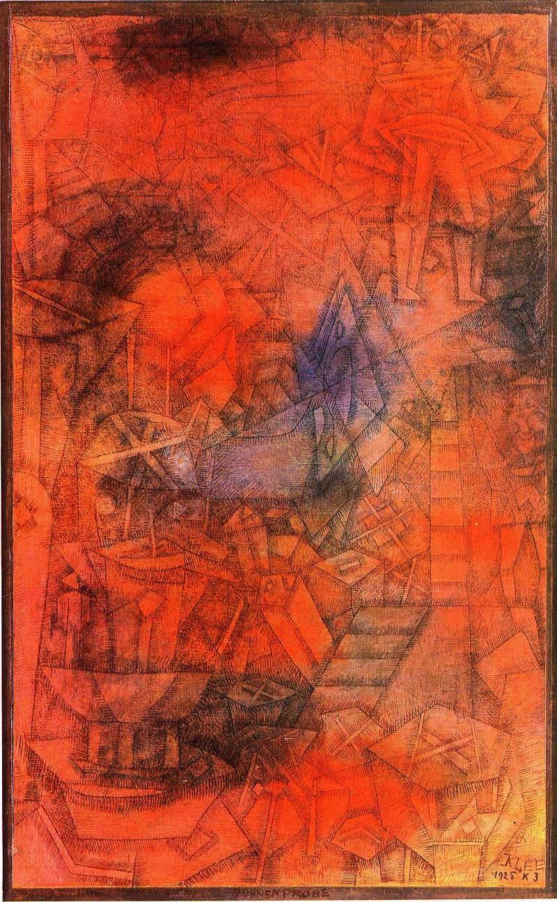

[🏠 Home](../../index.md)

# March 14

## 🧑‍🎨 Painting of the day

[Paul Klee](https://en.wikipedia.org/wiki/Paul_Klee) (Expressionism, Abstractionism, Surrealism)

<button class="btn btn-success"
onclick=" window.open('https://lens.google.com/uploadbyurl?url=https://iretes.github.io/one-a-day/data/img/Paul_Klee_7.jpg','_blank')">
Search with Google Lens
</button>

## 🎼 Song of the day

> *Mystery Train*
by Elvis Presley

 Written by Junior Parker, Sam Phillips.

Released in Sept. , 1955.

<button class="btn btn-success"
onclick=" window.open('http://www.youtube.com/search?q=Mystery Train by Elvis Presley','_blank')">
Search on YouTube
</button>

## 🏛️ UNESCO heritage site of the day

> *Niokolo-Koba National Park*, Senegal

Located in a well-watered area along the banks of the Gambia river, the gallery forests and savannahs of Niokolo-Koba National Park have a very rich fauna, among them Derby elands (largest of the antelopes), chimpanzees, lions, leopards and a large population of elephants, as well as many birds, reptiles and amphibians.

<button class="btn btn-success"
onclick=" window.open('http://www.google.com/search?q=Niokolo-Koba National Park','_blank')">
Search on Google
</button>

## 🗺️ Place of the day

<iframe
src="https://www.mapcrunch.com"
name="mapcrunch"
width="500"
height="500"
allowTransparency="true"
scrolling="no"
frameborder="0"
>
</iframe>
## 🎨 Color of the day

> *[Spring green](https://en.wikipedia.org/wiki/Spring_green_(color))*

&#9632;

## 🌿 Plant of the day

> *hemp dogbane*

<button class="btn btn-success"
onclick=" window.open('http://www.google.com/search?q=hemp dogbane','_blank')">
Search on Google
</button>

## 🧑‍🔬 Scientific discovery of the day

> *1843: James Prescott Joule: Law of Conservation of energy (First law of thermodynamics), also 1847 – Helmholtz, Conservation of energy.*

<button class="btn btn-success"
onclick=" window.open('http://www.google.com/search?q=1843: James Prescott Joule: Law of Conservation of energy (First law of thermodynamics), also 1847 – Helmholtz, Conservation of energy.','_blank')"> 
Search on Google
</button>

## 💭 Philosophical concept of the day

> *[Cambridge change](https://en.wikipedia.org/wiki/Cambridge_change)*

## 🗣️ Saying of the day

> *The pip - Get/got/have *

Become irritated or annoyed. 
