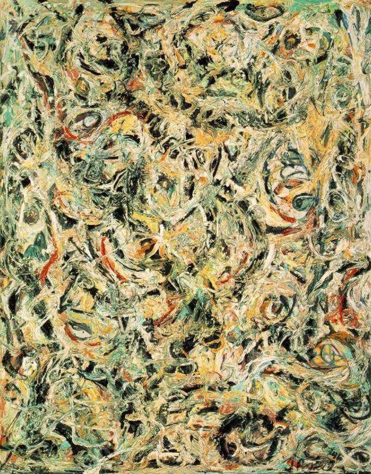

[🏠 Home](../../index.md)

# March 15

## 🧑‍🎨 Painting of the day

[Jackson Pollock](http://en.wikipedia.org/wiki/Jackson_Pollock) (Abstract Expressionism)

<button class="btn btn-success"
onclick=" window.open('https://lens.google.com/uploadbyurl?url=https://iretes.github.io/one-a-day/data/img/Jackson_Pollock_5.jpg','_blank')">
Search with Google Lens
</button>

## 🎼 Song of the day

> *Strawberry Fields Forever*
by The Beatles

 Written by John Lennon, Paul McCartney.

Released in Feb. , 1967.

<button class="btn btn-success"
onclick=" window.open('http://www.youtube.com/search?q=Strawberry Fields Forever by The Beatles','_blank')">
Search on YouTube
</button>

## 🏛️ UNESCO heritage site of the day

> *Gulf of Porto: Calanche of Piana, Gulf of Girolata, Scandola Reserve*, France

The nature reserve, which is part of the Regional Natural Park of Corsica, occupies the Scandola peninsula, an impressive, porphyritic rock mass. The vegetation is an outstanding example of scrubland. Seagulls, cormorants and sea eagles can be found there. The clear waters, with their islets and inaccessible caves, host a rich marine life.

<button class="btn btn-success"
onclick=" window.open('http://www.google.com/search?q=Gulf of Porto: Calanche of Piana, Gulf of Girolata, Scandola Reserve','_blank')">
Search on Google
</button>

## 🗺️ Place of the day

<iframe
src="https://www.mapcrunch.com"
name="mapcrunch"
width="500"
height="500"
allowTransparency="true"
scrolling="no"
frameborder="0"
>
</iframe>
## 🎨 Color of the day

> *[Prussian blue](https://en.wikipedia.org/wiki/Prussian_blue)*

&#9632;

## 🌿 Plant of the day

> *wormwood*

<button class="btn btn-success"
onclick=" window.open('http://www.google.com/search?q=wormwood','_blank')">
Search on Google
</button>

## 🧑‍🔬 Scientific discovery of the day

> *499: Aryabhata gives a new symbol for zero and uses it for the decimal system.*

<button class="btn btn-success"
onclick=" window.open('http://www.google.com/search?q=499: Aryabhata gives a new symbol for zero and uses it for the decimal system.','_blank')"> 
Search on Google
</button>

## 💭 Philosophical concept of the day

> *[Sittlichkeit](https://en.wikipedia.org/wiki/Sittlichkeit)*

## 🗣️ Saying of the day

> *Daft as a brush*

To be 'as daft as a brush' is to be very stupid or foolish.

## 🏳️‍🌈 International day

International Day to Combat Islamophobia.