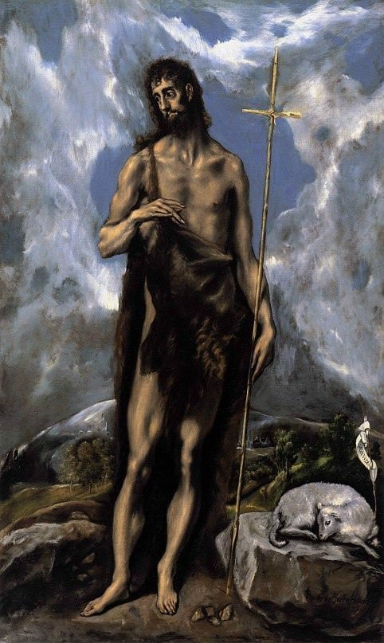

[🏠 Home](../../index.md)

# March 16

## 🧑‍🎨 Painting of the day

[El Greco](http://en.wikipedia.org/wiki/El_Greco) (Mannerism)

<button class="btn btn-success"
onclick=" window.open('https://lens.google.com/uploadbyurl?url=https://iretes.github.io/one-a-day/data/img/El_Greco_7.jpg','_blank')">
Search with Google Lens
</button>

## 🎼 Song of the day

> *Whole Lotta Love*
by Led Zeppelin

 Written by Willie Dixon, Led Zeppelin.

Released in Oct. , 1969.

<button class="btn btn-success"
onclick=" window.open('http://www.youtube.com/search?q=Whole Lotta Love by Led Zeppelin','_blank')">
Search on YouTube
</button>

## 🏛️ UNESCO heritage site of the day

> *West Lake Cultural Landscape of Hangzhou*, China

The West Lake Cultural Landscape of Hangzhou, comprising the West Lake and the hills surrounding its three sides, has inspired famous poets, scholars and artists since the 9th century. It comprises numerous temples, pagodas, pavilions, gardens and ornamental trees, as well as causeways and artificial islands. These additions have been made to improve the landscape west of the city of Hangzhou to the south of the Yangtze river.

The West Lake has influenced garden design in the rest of China as well as Japan and Korea over the centuries and bears an exceptional testimony to the cultural tradition of improving landscapes to create a series of vistas reflecting an idealised fusion between humans and nature.

 

<button class="btn btn-success"
onclick=" window.open('http://www.google.com/search?q=West Lake Cultural Landscape of Hangzhou','_blank')">
Search on Google
</button>

## 🗺️ Place of the day

<iframe
src="https://www.mapcrunch.com"
name="mapcrunch"
width="500"
height="500"
allowTransparency="true"
scrolling="no"
frameborder="0"
>
</iframe>
## 🎨 Color of the day

> *[Majorelle blue](https://en.wikipedia.org/wiki/Majorelle_Blue)*

&#9632;

## 🌿 Plant of the day

> *rambler rose*

<button class="btn btn-success"
onclick=" window.open('http://www.google.com/search?q=rambler rose','_blank')">
Search on Google
</button>

## 🧑‍🔬 Scientific discovery of the day

> *2nd century: Ptolemy formalises the epicycles of Apollonius.*

<button class="btn btn-success"
onclick=" window.open('http://www.google.com/search?q=2nd century: Ptolemy formalises the epicycles of Apollonius.','_blank')"> 
Search on Google
</button>

## 💭 Philosophical concept of the day

> *[Principle](https://en.wikipedia.org/wiki/Principle)*

## 🗣️ Saying of the day

> *Absent without leave*

Absent without permission.
