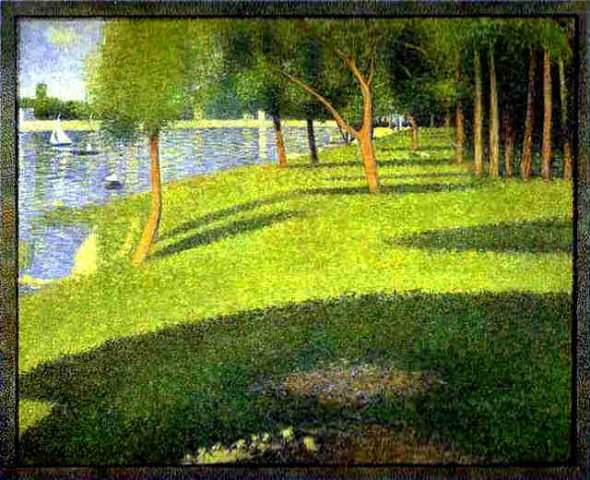

[🏠 Home](../../index.md)

# March 2

## 🧑‍🎨 Painting of the day

[Georges Seurat](https://en.wikipedia.org/wiki/Georges_Seurat) (Post-Impressionism)

<button class="btn btn-success"
onclick=" window.open('https://lens.google.com/uploadbyurl?url=https://iretes.github.io/one-a-day/data/img/Georges_Seurat_1.jpg','_blank')">
Search with Google Lens
</button>

## 🎼 Song of the day

> *California Dreamin*
by The Mamas and the Papas

 Written by John and Michelle Phillips.

Released in Dec. , 1965.

<button class="btn btn-success"
onclick=" window.open('http://www.youtube.com/search?q=California Dreamin by The Mamas and the Papas','_blank')">
Search on YouTube
</button>

## 🏛️ UNESCO heritage site of the day

> *Schokland and Surroundings*, Netherlands

Schokland was a peninsula that by the 15th century had become an island. Occupied and then abandoned as the sea encroached, it had to be evacuated in 1859. But following the draining of the Zuider Zee, it has, since the 1940s, formed part of the land reclaimed from the sea. Schokland has vestiges of human habitation going back to prehistoric times. It symbolizes the heroic, age-old struggle of the people of the Netherlands against the encroachment of the waters.

<button class="btn btn-success"
onclick=" window.open('http://www.google.com/search?q=Schokland and Surroundings','_blank')">
Search on Google
</button>

## 🗺️ Place of the day

<iframe
src="https://www.mapcrunch.com"
name="mapcrunch"
width="500"
height="500"
allowTransparency="true"
scrolling="no"
frameborder="0"
>
</iframe>
## 🎨 Color of the day

> *[Light yellow](https://en.wikipedia.org/wiki/Shades_of_yellow#Light_yellow)*

&#9632;

## 🌿 Plant of the day

> *scurvy cress*

<button class="btn btn-success"
onclick=" window.open('http://www.google.com/search?q=scurvy cress','_blank')">
Search on Google
</button>

## 🧑‍🔬 Scientific discovery of the day

> *1929: Lars Onsager's reciprocal relations, a potential fourth law of thermodynamics*

<button class="btn btn-success"
onclick=" window.open('http://www.google.com/search?q=1929: Lars Onsager s reciprocal relations, a potential fourth law of thermodynamics','_blank')">
Search on Google
</button>

## 💭 Philosophical concept of the day

> *[Thrownness](https://en.wikipedia.org/wiki/Thrownness)*

## 🗣️ Saying of the day

> *Davy Jones' locker*

The bottom of the sea; the mythical resting place of drowned mariners.
