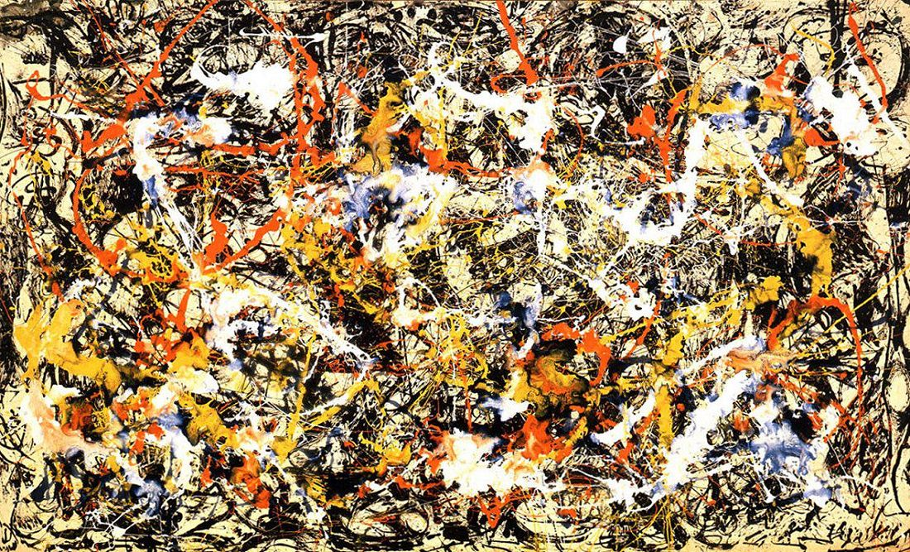

[🏠 Home](../../index.md)

# March 20

## 🧑‍🎨 Painting of the day

[Jackson Pollock](http://en.wikipedia.org/wiki/Jackson_Pollock) (Abstract Expressionism)

<button class="btn btn-success"
onclick=" window.open('https://lens.google.com/uploadbyurl?url=https://iretes.github.io/one-a-day/data/img/Jackson_Pollock_4.jpg','_blank')">
Search with Google Lens
</button>

## 🎼 Song of the day

> *Papas Got A Brand New Bag*
by James Brown

 Written by Brown.

Released in July , 1966.

<button class="btn btn-success"
onclick=" window.open('http://www.youtube.com/search?q=Papas Got A Brand New Bag by James Brown','_blank')">
Search on YouTube
</button>

## 🏛️ UNESCO heritage site of the day

> *Vat Phou and Associated Ancient Settlements within the Champasak Cultural Landscape*, Lao People's Democratic Republic

The Champasak cultural landscape, including the Vat Phou Temple complex, is a remarkably well-preserved planned landscape more than 1,000 years old. It was shaped to express the Hindu vision of the relationship between nature and humanity, using an axis from mountain top to river bank to lay out a geometric pattern of temples, shrines and waterworks extending over some 10 km. Two planned cities on the banks of the Mekong River are also part of the site, as well as Phou Kao mountain. The whole represents a development ranging from the 5th to 15th centuries, mainly associated with the Khmer Empire.

<button class="btn btn-success"
onclick=" window.open('http://www.google.com/search?q=Vat Phou and Associated Ancient Settlements within the Champasak Cultural Landscape','_blank')">
Search on Google
</button>

## 🗺️ Place of the day

<iframe
src="https://www.mapcrunch.com"
name="mapcrunch"
width="500"
height="500"
allowTransparency="true"
scrolling="no"
frameborder="0"
>
</iframe>
## 🎨 Color of the day

> *[Japanese carmine](https://en.wikipedia.org/wiki/Carmine_(color)#Japanese_carmine)*

&#9632;

## 🌿 Plant of the day

> *fluxroot*

<button class="btn btn-success"
onclick=" window.open('http://www.google.com/search?q=fluxroot','_blank')">
Search on Google
</button>

## 🧑‍🔬 Scientific discovery of the day

> *1951: George Otto Gey propagates first cancer cell line, HeLa*

<button class="btn btn-success"
onclick=" window.open('http://www.google.com/search?q=1951: George Otto Gey propagates first cancer cell line, HeLa','_blank')"> 
Search on Google
</button>

## 💭 Philosophical concept of the day

> *[Subject](https://en.wikipedia.org/wiki/Subject_(philosophy))*

## 🗣️ Saying of the day

> *Heart's content*

To one's (or your) heart's content means to one's complete inner satisfaction - until one's heart is content. 

## 🏳️‍🌈 International day

International Day of Happiness, French Language Day.