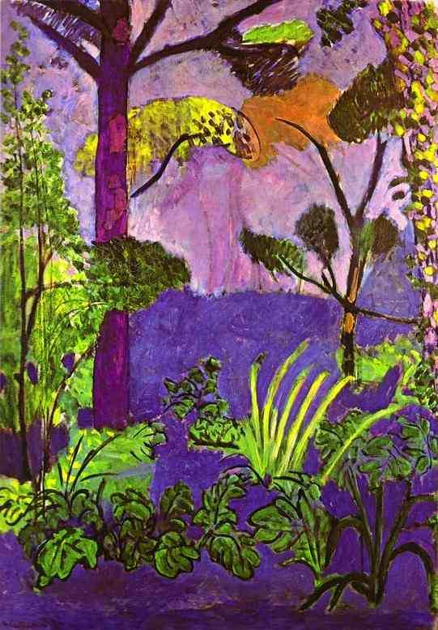

[🏠 Home](../../index.md)

# March 22

## 🧑‍🎨 Painting of the day

[Henri Matisse](http://en.wikipedia.org/wiki/Henri_Matisse) (Impressionism, Post-Impressionism)

<button class="btn btn-success"
onclick=" window.open('https://lens.google.com/uploadbyurl?url=https://iretes.github.io/one-a-day/data/img/Henri_Matisse_6.jpg','_blank')">
Search with Google Lens
</button>

## 🎼 Song of the day

> *Crying*
by Roy Orbison

 Written by Joe Melson, Orbison.

Released in Aug. , 1961.

<button class="btn btn-success"
onclick=" window.open('http://www.youtube.com/search?q=Crying by Roy Orbison','_blank')">
Search on YouTube
</button>

## 🏛️ UNESCO heritage site of the day

> *Naval Port of Karlskrona*, Sweden

Karlskrona is an outstanding example of a late-17th-century European planned naval city. The original plan and many of the buildings have survived intact, along with installations that illustrate its subsequent development up to the present day.

<button class="btn btn-success"
onclick=" window.open('http://www.google.com/search?q=Naval Port of Karlskrona','_blank')">
Search on Google
</button>

## 🗺️ Place of the day

<iframe
src="https://www.mapcrunch.com"
name="mapcrunch"
width="500"
height="500"
allowTransparency="true"
scrolling="no"
frameborder="0"
>
</iframe>
## 🎨 Color of the day

> *[Violet (RYB)](https://en.wikipedia.org/wiki/RYB_color_model)*

&#9632;

## 🌿 Plant of the day

> *cutleaf coneflower*

<button class="btn btn-success"
onclick=" window.open('http://www.google.com/search?q=cutleaf coneflower','_blank')">
Search on Google
</button>

## 🧑‍🔬 Scientific discovery of the day

> *1838: Friedrich Bessel: first successful measure of stellar parallax (to star 61 Cygni).*

<button class="btn btn-success"
onclick=" window.open('http://www.google.com/search?q=1838: Friedrich Bessel: first successful measure of stellar parallax (to star 61 Cygni).','_blank')"> 
Search on Google
</button>

## 💭 Philosophical concept of the day

> *[Übermensch](https://en.wikipedia.org/wiki/%C3%9Cbermensch)*

## 🗣️ Saying of the day

> *Field day*

A day of excitement or a circumstance of opportunity.

## 🏳️‍🌈 International day

World Water Day.