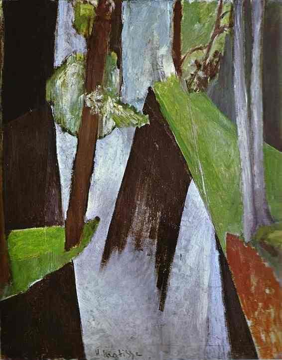

[🏠 Home](../../index.md)

# March 23

## 🧑‍🎨 Painting of the day

[Henri Matisse](http://en.wikipedia.org/wiki/Henri_Matisse) (Impressionism, Post-Impressionism)

<button class="btn btn-success"
onclick=" window.open('https://lens.google.com/uploadbyurl?url=https://iretes.github.io/one-a-day/data/img/Henri_Matisse_2.jpg','_blank')">
Search with Google Lens
</button>

## 🎼 Song of the day

> *Tangled Up in Blue*
by Bob Dylan

 Written by Dylan.

Released in Jan. , 1975.

<button class="btn btn-success"
onclick=" window.open('http://www.youtube.com/search?q=Tangled Up in Blue by Bob Dylan','_blank')">
Search on YouTube
</button>

## 🏛️ UNESCO heritage site of the day

> *Budapest, including the Banks of the Danube, the Buda Castle Quarter and Andrássy Avenue*, Hungary

This site has the remains of monuments such as the Roman city of Aquincum and the Gothic castle of Buda, which have had a considerable influence on the architecture of various periods. It is one of the world's outstanding urban landscapes and illustrates the great periods in the history of the Hungarian capital.

<button class="btn btn-success"
onclick=" window.open('http://www.google.com/search?q=Budapest, including the Banks of the Danube, the Buda Castle Quarter and Andrássy Avenue','_blank')">
Search on Google
</button>

## 🗺️ Place of the day

<iframe
src="https://www.mapcrunch.com"
name="mapcrunch"
width="500"
height="500"
allowTransparency="true"
scrolling="no"
frameborder="0"
>
</iframe>
## 🎨 Color of the day

> *[Wild Strawberry](https://en.wikipedia.org/wiki/List_of_Crayola_crayon_colors#Standard_colors)*

&#9632;

## 🌿 Plant of the day

> *tulsi*

<button class="btn btn-success"
onclick=" window.open('http://www.google.com/search?q=tulsi','_blank')">
Search on Google
</button>

## 🧑‍🔬 Scientific discovery of the day

> *1802: Jean-Baptiste Lamarck: teleological evolution.*

<button class="btn btn-success"
onclick=" window.open('http://www.google.com/search?q=1802: Jean-Baptiste Lamarck: teleological evolution.','_blank')"> 
Search on Google
</button>

## 💭 Philosophical concept of the day

> *[Omphalos hypothesis](https://en.wikipedia.org/wiki/Omphalos_hypothesis)*

## 🗣️ Saying of the day

> *Leopard cannot change its spots - A *

The
          proverbial saying 'A leopard cannot change its spots' expresses the notion that things cannot change their innate nature. It is normally used to suggest that  people who have done bad things will always be bad people.

## 🏳️‍🌈 International day

World Meteorological Day.