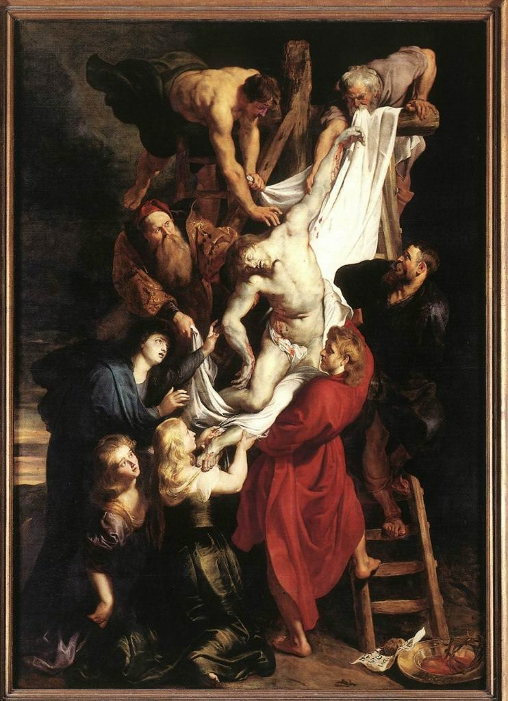

[🏠 Home](../../index.md)

# March 24

## 🧑‍🎨 Painting of the day

[Peter Paul Rubens](http://en.wikipedia.org/wiki/Peter_Paul_Rubens) (Baroque)

<button class="btn btn-success"
onclick=" window.open('https://lens.google.com/uploadbyurl?url=https://iretes.github.io/one-a-day/data/img/Peter_Paul_Rubens_2.jpg','_blank')">
Search with Google Lens
</button>

## 🎼 Song of the day

> *Jailhouse Rock*
by Elvis Presley

 Written by Jerry Leiber, Mike Stoller.

Released in Oct. , 1957.

<button class="btn btn-success"
onclick=" window.open('http://www.youtube.com/search?q=Jailhouse Rock by Elvis Presley','_blank')">
Search on YouTube
</button>

## 🏛️ UNESCO heritage site of the day

> *Royal Domain of Drottningholm*, Sweden

The Royal Domain of Drottningholm stands on an island in Lake Mälar in a suburb of Stockholm. With its castle, perfectly preserved theatre (built in 1766), Chinese pavilion and gardens, it is the finest example of an 18th-century north European royal residence inspired by the Palace of Versailles.

<button class="btn btn-success"
onclick=" window.open('http://www.google.com/search?q=Royal Domain of Drottningholm','_blank')">
Search on Google
</button>

## 🗺️ Place of the day

<iframe
src="https://www.mapcrunch.com"
name="mapcrunch"
width="500"
height="500"
allowTransparency="true"
scrolling="no"
frameborder="0"
>
</iframe>
## 🎨 Color of the day

> *[Dark spring green](https://en.wikipedia.org/wiki/Spring_green#Dark_spring_green)*

&#9632;

## 🌿 Plant of the day

> *clump foot cabbage*

<button class="btn btn-success"
onclick=" window.open('http://www.google.com/search?q=clump foot cabbage','_blank')">
Search on Google
</button>

## 🧑‍🔬 Scientific discovery of the day

> *1517: Nicolaus Copernicus develops the quantity theory of money and states the earliest known form of Gresham's law: ("Bad money drowns out good").*

<button class="btn btn-success"
onclick=" window.open('http://www.google.com/search?q=1517: Nicolaus Copernicus develops the quantity theory of money and states the earliest known form of Gresham s law: ("Bad money drowns out good").','_blank')">
Search on Google
</button>

## 💭 Philosophical concept of the day

> *[Sense data](https://en.wikipedia.org/wiki/Sense_data)*

## 🗣️ Saying of the day

> *Fair to middling*

Slightly above average.

## 🏳️‍🌈 International day

World Tuberculosis Day, International Day for the Right to the Truth concerning Gross Human Rights Violations and for the Dignity of Victims.