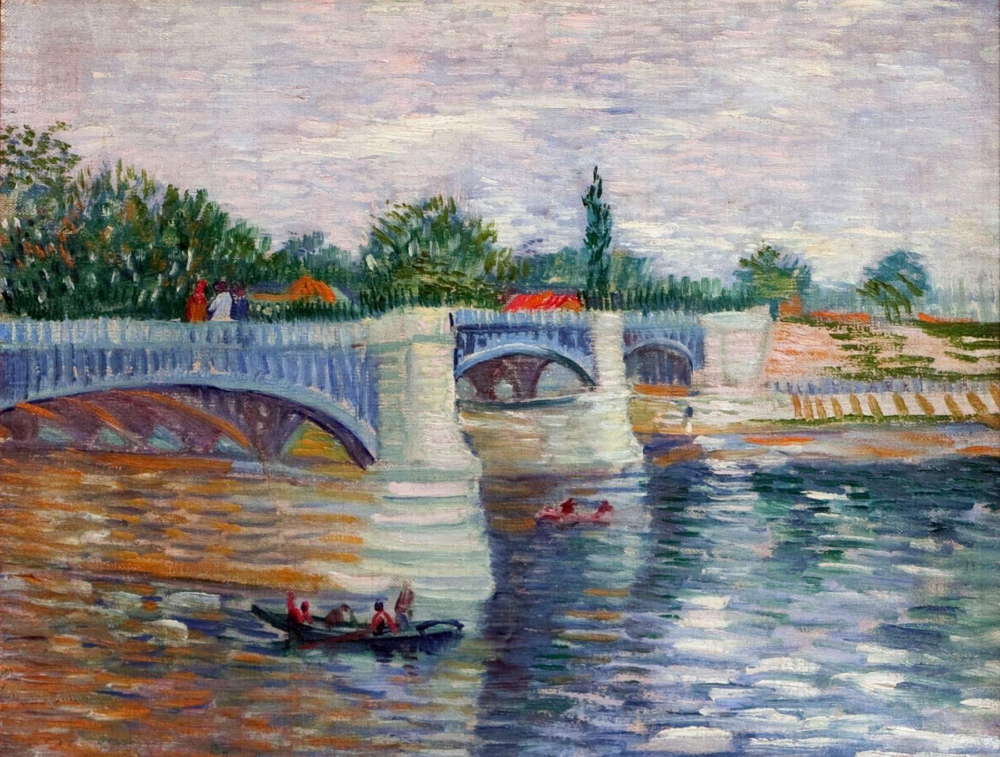

[🏠 Home](../../index.md)

# March 26

## 🧑‍🎨 Painting of the day

[Vincent van Gogh](http://en.wikipedia.org/wiki/Vincent_van_Gogh) (Post-Impressionism)

<button class="btn btn-success"
onclick=" window.open('https://lens.google.com/uploadbyurl?url=https://iretes.github.io/one-a-day/data/img/Vincent_van_Gogh_5.jpg','_blank')">
Search with Google Lens
</button>

## 🎼 Song of the day

> *Sunshine of Your Love*
by Cream

 Written by Jack Bruce, Pete Brown, Eric Clapton.

Released in Jan. , 1968.

<button class="btn btn-success"
onclick=" window.open('http://www.youtube.com/search?q=Sunshine of Your Love by Cream','_blank')">
Search on YouTube
</button>

## 🏛️ UNESCO heritage site of the day

> *Crac des Chevaliers and Qal’at Salah El-Din*, Syrian Arab Republic

These two castles represent the most significant examples illustrating the exchange of influences and documenting the evolution of fortified architecture in the Near East during the time of the Crusades (11th - 13th centuries). The Crac des Chevaliers was built by the Hospitaller Order of Saint John of Jerusalem from 1142 to 1271. With further construction by the Mamluks in the late 13th century, it ranks among the best-preserved examples of the Crusader castles. The Qal&rsquo;at Salah El-Din (Fortress of Saladin), even though partly in ruins, represents an outstanding example of this type of fortification, both in terms of the quality of construction and the survival of historical stratigraphy. It retains features from its Byzantine beginnings in the 10th century, the Frankish transformations in the late 12th century and fortifications added by the Ayyubid dynasty (late 12th to mid-13th century).

<button class="btn btn-success"
onclick=" window.open('http://www.google.com/search?q=Crac des Chevaliers and Qal’at Salah El-Din','_blank')">
Search on Google
</button>

## 🗺️ Place of the day

<iframe
src="https://www.mapcrunch.com"
name="mapcrunch"
width="500"
height="500"
allowTransparency="true"
scrolling="no"
frameborder="0"
>
</iframe>
## 🎨 Color of the day

> *[Cadmium orange](https://en.wikipedia.org/wiki/Cadmium_pigments)*

&#9632;

## 🌿 Plant of the day

> *viburnum*

<button class="btn btn-success"
onclick=" window.open('http://www.google.com/search?q=viburnum','_blank')">
Search on Google
</button>

## 🧑‍🔬 Scientific discovery of the day

> *2010: The Neanderthal Genome Project presented preliminary genetic evidence that interbreeding did likely take place and that a small but significant portion of Neanderthal admixture is present in modern non-African populations.*

<button class="btn btn-success"
onclick=" window.open('http://www.google.com/search?q=2010: The Neanderthal Genome Project presented preliminary genetic evidence that interbreeding did likely take place and that a small but significant portion of Neanderthal admixture is present in modern non-African populations.','_blank')">
Search on Google
</button>

## 💭 Philosophical concept of the day

> *[Infinity](https://en.wikipedia.org/wiki/Infinity_(philosophy))*

## 🗣️ Saying of the day

> *Dreams of empire*

The aimless longing for glory. 
