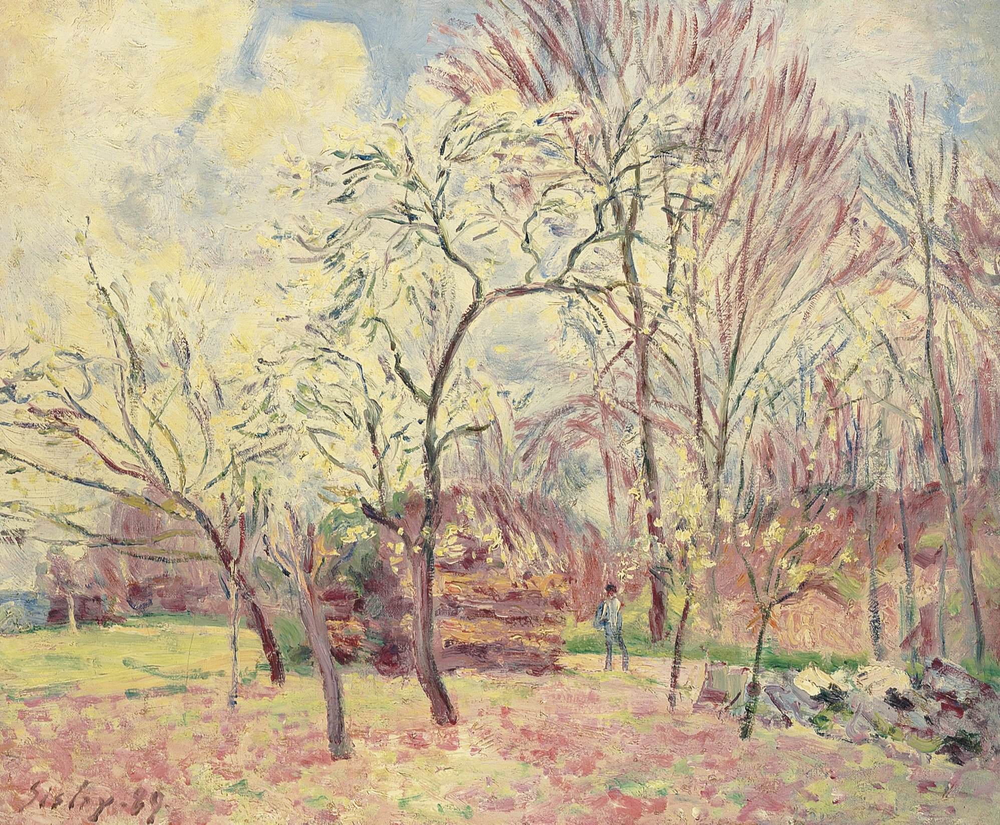

[🏠 Home](../../index.md)

# March 3

## 🧑‍🎨 Painting of the day

[Alfred Sisley](http://en.wikipedia.org/wiki/Alfred_Sisley) (Impressionism)

<button class="btn btn-success"
onclick=" window.open('https://lens.google.com/uploadbyurl?url=https://iretes.github.io/one-a-day/data/img/Alfred_Sisley_3.jpg','_blank')">
Search with Google Lens
</button>

## 🎼 Song of the day

> *My Girl*
by The Temptations

 Written by Smokey Robinson, Ronald White.

Released in Jan. , 1965.

<button class="btn btn-success"
onclick=" window.open('http://www.youtube.com/search?q=My Girl by The Temptations','_blank')">
Search on YouTube
</button>

## 🏛️ UNESCO heritage site of the day

> *Discovery Coast Atlantic Forest Reserves*, Brazil

The Discovery Coast Atlantic Forest Reserves, in the states of Bahia and Esp&iacute;rito Santo, consist of eight separate protected areas containing 112,000 ha of Atlantic forest and associated shrub (<em>restingas</em>). The rainforests of Brazil&rsquo;s Atlantic coast are the world&rsquo;s richest in terms of biodiversity. The site contains a distinct range of species with a high level of endemism and reveals a pattern of evolution that is not only of great scientific interest but is also of importance for conservation.

<button class="btn btn-success"
onclick=" window.open('http://www.google.com/search?q=Discovery Coast Atlantic Forest Reserves','_blank')">
Search on Google
</button>

## 🗺️ Place of the day

<iframe
src="https://www.mapcrunch.com"
name="mapcrunch"
width="500"
height="500"
allowTransparency="true"
scrolling="no"
frameborder="0"
>
</iframe>
## 🎨 Color of the day

> *[Vivid tangerine](https://en.wikipedia.org/wiki/List_of_Crayola_crayon_colors#Standard_colors)*

&#9632;

## 🌿 Plant of the day

> *yellow fume wort*

<button class="btn btn-success"
onclick=" window.open('http://www.google.com/search?q=yellow fume wort','_blank')">
Search on Google
</button>

## 🧑‍🔬 Scientific discovery of the day

> *1745: Ewald Georg von Kleist first capacitor, the Leyden jar.*

<button class="btn btn-success"
onclick=" window.open('http://www.google.com/search?q=1745: Ewald Georg von Kleist first capacitor, the Leyden jar.','_blank')"> 
Search on Google
</button>

## 💭 Philosophical concept of the day

> *[Taste](https://en.wikipedia.org/wiki/Taste_(sociology))*

## 🗣️ Saying of the day

> *A picture is worth a thousand words*

A picture tells a story just as well as, if not better than, a lot of written words.

## 🏳️‍🌈 International day

World Wildlife Day.