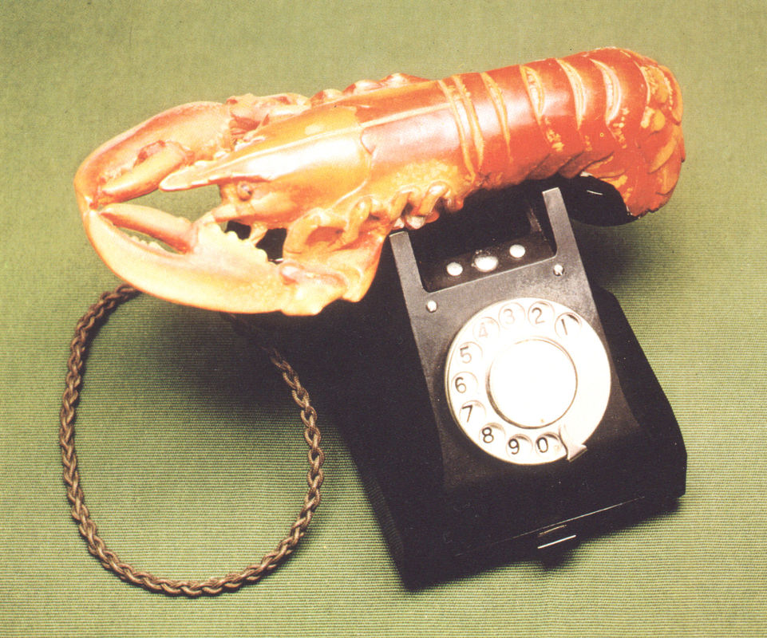

[🏠 Home](../../index.md)

# March 30

## 🧑‍🎨 Painting of the day

[Salvador Dali](http://en.wikipedia.org/wiki/Salvador_Dalí) (Surrealism)

<button class="btn btn-success"
onclick=" window.open('https://lens.google.com/uploadbyurl?url=https://iretes.github.io/one-a-day/data/img/Salvador_Dali_8.jpg','_blank')">
Search with Google Lens
</button>

## 🎼 Song of the day

> *Whole Lotta Shakin Going On*
by Jerry Lee Lewis

 Written by Dave Williams, Roy Hall.

Released in June , 1957.

<button class="btn btn-success"
onclick=" window.open('http://www.youtube.com/search?q=Whole Lotta Shakin Going On by Jerry Lee Lewis','_blank')">
Search on YouTube
</button>

## 🏛️ UNESCO heritage site of the day

> *Zollverein Coal Mine Industrial Complex in Essen*, Germany

The Zollverein industrial complex in Land Nordrhein-Westfalen consists of the complete infrastructure of a historical coal-mining site, with some 20th-century buildings of outstanding architectural merit. It constitutes remarkable material evidence of the evolution and decline of an essential industry over the past 150 years.

<button class="btn btn-success"
onclick=" window.open('http://www.google.com/search?q=Zollverein Coal Mine Industrial Complex in Essen','_blank')">
Search on Google
</button>

## 🗺️ Place of the day

<iframe
src="https://www.mapcrunch.com"
name="mapcrunch"
width="500"
height="500"
allowTransparency="true"
scrolling="no"
frameborder="0"
>
</iframe>
## 🎨 Color of the day

> *[Lime (color wheel)](https://en.wikipedia.org/wiki/Lime_(color))*

&#9632;

## 🌿 Plant of the day

> *poke*

<button class="btn btn-success"
onclick=" window.open('http://www.google.com/search?q=poke','_blank')">
Search on Google
</button>

## 🧑‍🔬 Scientific discovery of the day

> *4th century BC: Menaechmus discovers conic sections.*

<button class="btn btn-success"
onclick=" window.open('http://www.google.com/search?q=4th century BC: Menaechmus discovers conic sections.','_blank')"> 
Search on Google
</button>

## 💭 Philosophical concept of the day

> *[Jus soli](https://en.wikipedia.org/wiki/Jus_soli)*

## 🗣️ Saying of the day

> *Cheek by jowl*

Side by side; in close or intimate proximity

## 🏳️‍🌈 International day

International Day of Zero Waste.