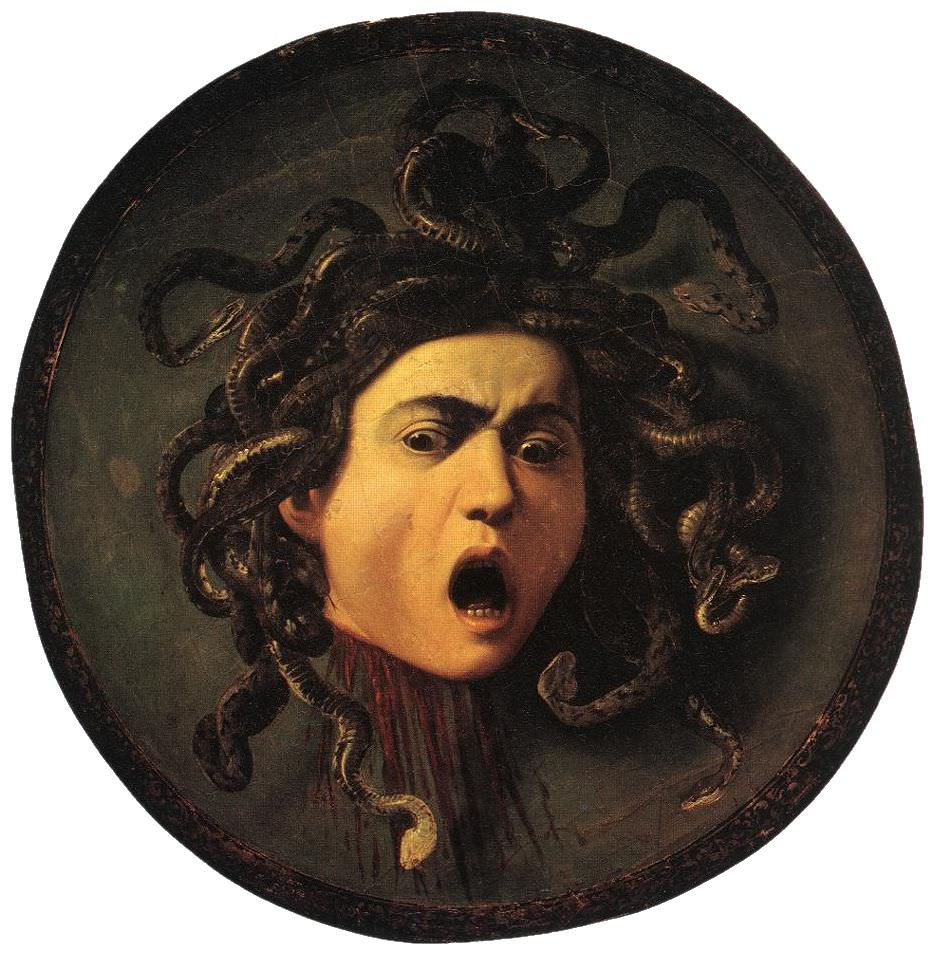

[🏠 Home](../../index.md)

# March 4

## 🧑‍🎨 Painting of the day

[Caravaggio](http://en.wikipedia.org/wiki/Caravaggio) (Baroque)

<button class="btn btn-success"
onclick=" window.open('https://lens.google.com/uploadbyurl?url=https://iretes.github.io/one-a-day/data/img/Caravaggio_4.jpg','_blank')">
Search with Google Lens
</button>

## 🎼 Song of the day

> *Ring of Fire*
by Johnny Cash

 Written by June Carter, Merle Kilgore.

Released in May , 1963.

<button class="btn btn-success"
onclick=" window.open('http://www.youtube.com/search?q=Ring of Fire by Johnny Cash','_blank')">
Search on YouTube
</button>

## 🏛️ UNESCO heritage site of the day

> *Works of Antoni Gaudí *, Spain

Seven properties built by the architect Antoni Gaudí (1852–1926) in or near Barcelona testify to Gaudí’s exceptional creative contribution to the development of architecture and building technology in the late 19th and early 20th centuries. These monuments represent an eclectic, as well as a very personal, style which was given free reign in the design of gardens, sculpture and all decorative arts, as well as architecture. The seven buildings are: Parque Güell; Palacio Güell; Casa Mila; Casa Vicens; Gaudí’s work on the Nativity façade and Crypt of La Sagrada Familia; Casa Batlló; Crypt in Colonia Güell.

<button class="btn btn-success"
onclick=" window.open('http://www.google.com/search?q=Works of Antoni Gaudí ','_blank')">
Search on Google
</button>

## 🗺️ Place of the day

<iframe
src="https://www.mapcrunch.com"
name="mapcrunch"
width="500"
height="500"
allowTransparency="true"
scrolling="no"
frameborder="0"
>
</iframe>
## 🎨 Color of the day

> *[Mikado yellow](https://en.wikipedia.org/wiki/Mikado_yellow)*

&#9632;

## 🌿 Plant of the day

> *wild pellitory*

<button class="btn btn-success"
onclick=" window.open('http://www.google.com/search?q=wild pellitory','_blank')">
Search on Google
</button>

## 🧑‍🔬 Scientific discovery of the day

> *1938: Isidor Rabi: Nuclear magnetic resonance*

<button class="btn btn-success"
onclick=" window.open('http://www.google.com/search?q=1938: Isidor Rabi: Nuclear magnetic resonance','_blank')">
Search on Google
</button>

## 💭 Philosophical concept of the day

> *[Problem of induction](https://en.wikipedia.org/wiki/Problem_of_induction)*

## 🗣️ Saying of the day

> *Tattoo phrases and sayings*

Almost all examples of the written word are found on paper. Until the late 20th century, the only significant alternative was on gravestones. We can now add another source - tattoos.
