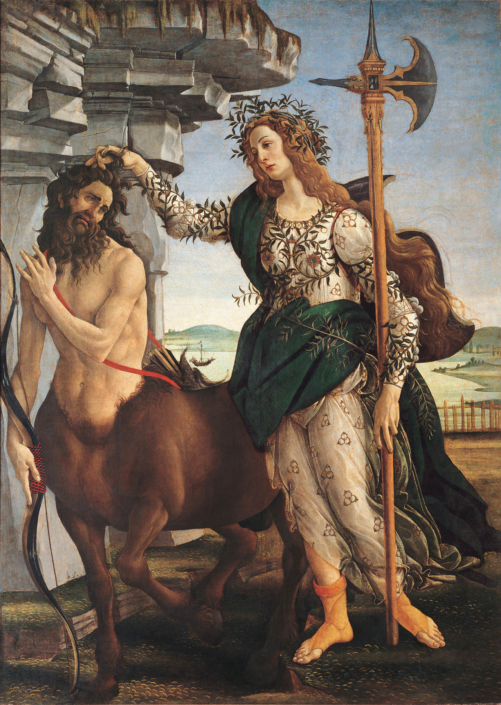

[🏠 Home](../../index.md)

# March 6

## 🧑‍🎨 Painting of the day

[Sandro Botticelli](http://en.wikipedia.org/wiki/Sandro_Botticelli) (Early Renaissance)

<button class="btn btn-success"
onclick=" window.open('https://lens.google.com/uploadbyurl?url=https://iretes.github.io/one-a-day/data/img/Sandro_Botticelli_3.jpg','_blank')">
Search with Google Lens
</button>

## 🎼 Song of the day

> *Crazy*
by Patsy Cline

 Written by Willie Nelson.

Released in Oct. , 1961.

<button class="btn btn-success"
onclick=" window.open('http://www.youtube.com/search?q=Crazy by Patsy Cline','_blank')">
Search on YouTube
</button>

## 🏛️ UNESCO heritage site of the day

> *Medina of Marrakesh*, Morocco

Founded in 1070–72 by the Almoravids, Marrakesh remained a political, economic and cultural centre for a long period. Its influence was felt throughout the western Muslim world, from North Africa to Andalusia. It has several impressive monuments dating from that period: the Koutoubiya Mosque, the Kasbah, the battlements, monumental doors, gardens, etc. Later architectural jewels include the Bandiâ Palace, the Ben Youssef <em>Madrasa</em>, the Saadian Tombs, several great residences and Place Jamaâ El Fna, a veritable open-air theatre.

<button class="btn btn-success"
onclick=" window.open('http://www.google.com/search?q=Medina of Marrakesh','_blank')">
Search on Google
</button>

## 🗺️ Place of the day

<iframe
src="https://www.mapcrunch.com"
name="mapcrunch"
width="500"
height="500"
allowTransparency="true"
scrolling="no"
frameborder="0"
>
</iframe>
## 🎨 Color of the day

> *[Kobe](https://en.wikipedia.org/wiki/Indian_red_(color)#Kobe)*

&#9632;

## 🌿 Plant of the day

> *scurvy grass*

<button class="btn btn-success"
onclick=" window.open('http://www.google.com/search?q=scurvy grass','_blank')">
Search on Google
</button>

## 🧑‍🔬 Scientific discovery of the day

> *1873: Johannes Diderik van der Waals: was one of the first to postulate an intermolecular force: the van der Waals force.*

<button class="btn btn-success"
onclick=" window.open('http://www.google.com/search?q=1873: Johannes Diderik van der Waals: was one of the first to postulate an intermolecular force: the van der Waals force.','_blank')">
Search on Google
</button>

## 💭 Philosophical concept of the day

> *[Simulation hypothesis](https://en.wikipedia.org/wiki/Simulation_hypothesis)*

## 🗣️ Saying of the day

> *Sealed with a loving kiss*

The full version of the acronym SWALK.
