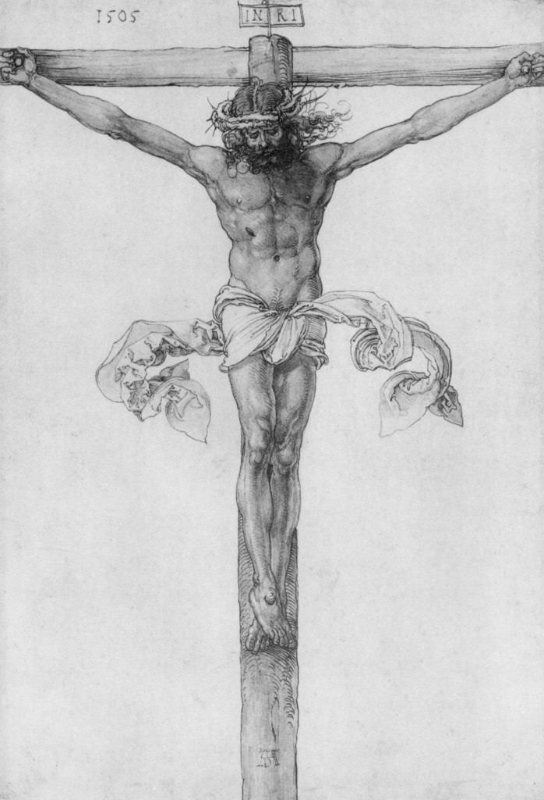

[🏠 Home](../../index.md)

# March 7

## 🧑‍🎨 Painting of the day

[Albrecht Dürer](http://en.wikipedia.org/wiki/Albrecht_Dürer) (Northern Renaissance)

<button class="btn btn-success"
onclick=" window.open('https://lens.google.com/uploadbyurl?url=https://iretes.github.io/one-a-day/data/img/Albrecht_Dürer_6.jpg','_blank')">
Search with Google Lens
</button>

## 🎼 Song of the day

> *Every Breath You Take*
by The Police

 Written by Sting.

Released in May , 1983.

<button class="btn btn-success"
onclick=" window.open('http://www.youtube.com/search?q=Every Breath You Take by The Police','_blank')">
Search on YouTube
</button>

## 🏛️ UNESCO heritage site of the day

> *Selimiye Mosque and its Social Complex*, Turkey

The square Mosque with its single great dome and four slender minarets, dominates the skyline of the former Ottoman capital of Edirne. Sinan, the most famous of Ottoman architects in the 16th century, considered the complex, which includes madrasas (Islamic schools), a covered market, clock house, outer courtyard and library, to be his best work. The interior decoration using Iznik tiles from the peak period of their production testifies to an art form that remains unsurpassed in this material. The complex is considered to be the most harmonious expression ever achieved of the Ottoman k&uuml;lliye, a group of buildings constructed around a mosque and managed as a single institution.

<button class="btn btn-success"
onclick=" window.open('http://www.google.com/search?q=Selimiye Mosque and its Social Complex','_blank')">
Search on Google
</button>

## 🗺️ Place of the day

<iframe
src="https://www.mapcrunch.com"
name="mapcrunch"
width="500"
height="500"
allowTransparency="true"
scrolling="no"
frameborder="0"
>
</iframe>
## 🎨 Color of the day

> *[Deep sky blue](https://en.wikipedia.org/wiki/Sky_blue#Deep_sky_blue)*

&#9632;

## 🌿 Plant of the day

> *winter cress*

<button class="btn btn-success"
onclick=" window.open('http://www.google.com/search?q=winter cress','_blank')">
Search on Google
</button>

## 🧑‍🔬 Scientific discovery of the day

> *2022: Text-to-image AI art systems such as DALL-E (1 and 2) and Stable Diffusion are announced, capable of generating highly detailed and realistic images from text prompts.*

<button class="btn btn-success"
onclick=" window.open('http://www.google.com/search?q=2022: Text-to-image AI art systems such as DALL-E (1 and 2) and Stable Diffusion are announced, capable of generating highly detailed and realistic images from text prompts.','_blank')">
Search on Google
</button>

## 💭 Philosophical concept of the day

> *[Intellectual responsibility](https://en.wikipedia.org/wiki/Intellectual_responsibility)*

## 🗣️ Saying of the day

> *Never the twain shall meet*

Two things which are so different as to have no opportunity to unite.
