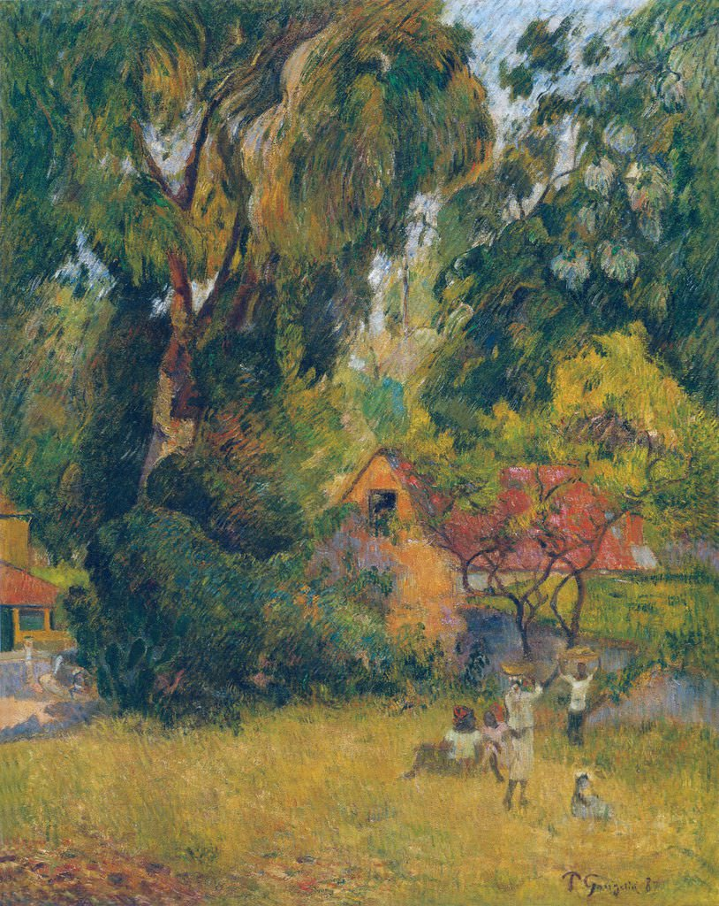

[🏠 Home](../../index.md)

# May 1

## 🧑‍🎨 Painting of the day

[Paul Gauguin](http://en.wikipedia.org/wiki/Paul_Gauguin) (Symbolism, Post-Impressionism)

<button class="btn btn-success"
onclick=" window.open('https://lens.google.com/uploadbyurl?url=https://iretes.github.io/one-a-day/data/img/Paul_Gauguin_8.jpg','_blank')">
Search with Google Lens
</button>

## 🎼 Song of the day

> *Mr. Tambourine Man*
by The Byrds

 Written by Bob Dylan.

Released in May , 1965.

<button class="btn btn-success"
onclick=" window.open('http://www.youtube.com/search?q=Mr. Tambourine Man by The Byrds','_blank')">
Search on YouTube
</button>

## 🏛️ UNESCO heritage site of the day

> *Bassari Country: Bassari, Fula and Bedik Cultural Landscapes*, Senegal

The site, located in south-east Senegal, includes three geographical areas: the Bassari–Salémata area, the Bedik–Bandafassi area and the Fula–Dindéfello area, each with its specific morphological traits. The Bassari, Fula and Bedik peoples settled from the 11th to the 19th centuries and developed specific cultures and habitats symbiotic with their surrounding natural environment. The Bassari landscape is marked by terraces and rice paddies, interspersed with villages, hamlets and archaeological sites. The Bedik villages are formed by dense groups of huts with steep thatched roofs. Their inhabitants’ cultural expressions are characterized by original traits of agro-pastoral, social, ritual and spiritual practices, which represent an original response to environmental constraints and human pressures. The site is a well-preserved multicultural landscape housing original and still vibrant local cultures.

<button class="btn btn-success"
onclick=" window.open('http://www.google.com/search?q=Bassari Country: Bassari, Fula and Bedik Cultural Landscapes','_blank')">
Search on Google
</button>

## 🗺️ Place of the day

<iframe
src="https://www.mapcrunch.com"
name="mapcrunch"
width="500"
height="500"
allowTransparency="true"
scrolling="no"
frameborder="0"
>
</iframe>
## 🎨 Color of the day

> *[Vivid burgundy](https://en.wikipedia.org/wiki/Burgundy_(color)#Vivid_burgundy)*

&#9632;

## 🌿 Plant of the day

> *fairymoss azolla caroliniana*

<button class="btn btn-success"
onclick=" window.open('http://www.google.com/search?q=fairymoss azolla caroliniana','_blank')">
Search on Google
</button>

## 🧑‍🔬 Scientific discovery of the day

> *1953: James Watson, Francis Crick, Maurice Wilkins and Rosalind Franklin: helical structure of DNA, basis for molecular biology*

<button class="btn btn-success"
onclick=" window.open('http://www.google.com/search?q=1953: James Watson, Francis Crick, Maurice Wilkins and Rosalind Franklin: helical structure of DNA, basis for molecular biology','_blank')">
Search on Google
</button>

## 💭 Philosophical concept of the day

> *[Causal adequacy principle](https://en.wikipedia.org/wiki/Causal_adequacy_principle)*

## 🗣️ Saying of the day

> *The balance of trade*

The
difference between the value of the imports and exports that a nation makes.
