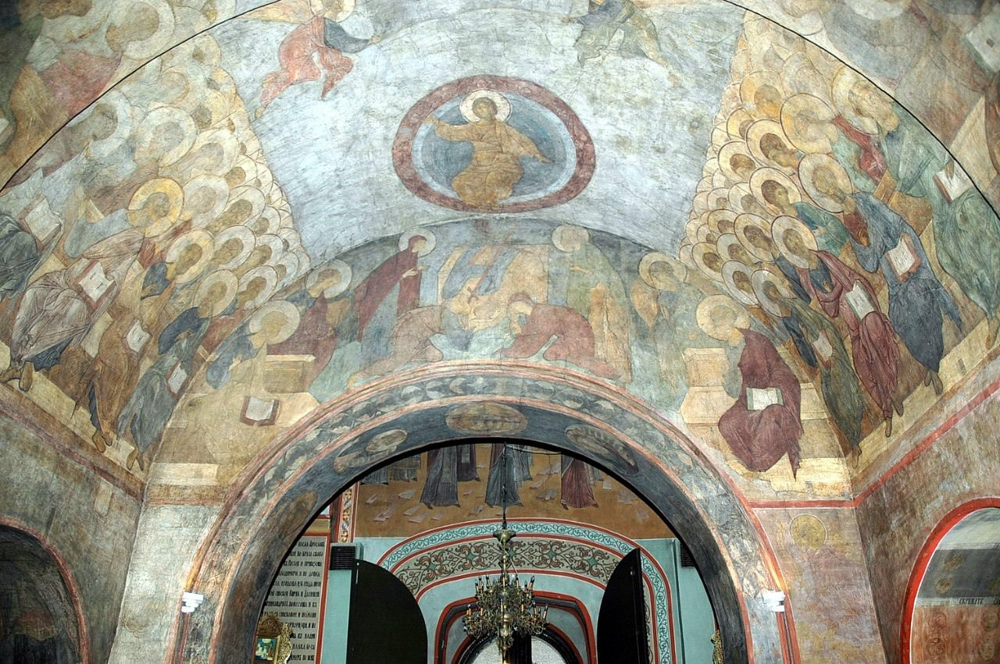

[🏠 Home](../../index.md)

# May 10

## 🧑‍🎨 Painting of the day

[Andrei Rublev](http://en.wikipedia.org/wiki/Andrei_Rublev) (Byzantine Art)

<button class="btn btn-success"
onclick=" window.open('https://lens.google.com/uploadbyurl?url=https://iretes.github.io/one-a-day/data/img/Andrei_Rublev_6.jpg','_blank')">
Search with Google Lens
</button>

## 🎼 Song of the day

> *Walk On By*
by Dionne Warwick

 Written by Burt Bacharach, Hal David.

Released in April , 1964.

<button class="btn btn-success"
onclick=" window.open('http://www.youtube.com/search?q=Walk On By by Dionne Warwick','_blank')">
Search on YouTube
</button>

## 🏛️ UNESCO heritage site of the day

> *Belfries of Belgium and France*, Belgium,France

Twenty-three belfries in the north of France and the belfry of Gembloux in Belgium were inscribed in 2005, as an extension to the 32 Belgian belfries inscribed in 1999 as Belfries of Flanders and Wallonia. Built between the 11th and 17th centuries, they showcase the Roman, Gothic, Renaissance and Baroque styles of architecture. They are highly significant tokens of the winning of civil liberties. While Italian, German and English towns mainly opted to build town halls, in part of north-western Europe, greater emphasis was placed on building belfries. Compared with the keep (symbol of the seigneurs) and the bell-tower (symbol of the Church), the belfry, the third tower in the urban landscape, symbolizes the power of the aldermen. Over the centuries, they came to represent the influence and wealth of the towns.

<button class="btn btn-success"
onclick=" window.open('http://www.google.com/search?q=Belfries of Belgium and France','_blank')">
Search on Google
</button>

## 🗺️ Place of the day

<iframe
src="https://www.mapcrunch.com"
name="mapcrunch"
width="500"
height="500"
allowTransparency="true"
scrolling="no"
frameborder="0"
>
</iframe>
## 🎨 Color of the day

> *[Honolulu blue](https://en.wikipedia.org/wiki/Shades_of_azure#Honolulu_blue)*

&#9632;

## 🌿 Plant of the day

> *orange milkweed*

<button class="btn btn-success"
onclick=" window.open('http://www.google.com/search?q=orange milkweed','_blank')">
Search on Google
</button>

## 🧑‍🔬 Scientific discovery of the day

> *1952: Stanley Miller: demonstrated that the building blocks of life could arise from primeval soup in the conditions present during early Earth (Miller-Urey experiment)*

<button class="btn btn-success"
onclick=" window.open('http://www.google.com/search?q=1952: Stanley Miller: demonstrated that the building blocks of life could arise from primeval soup in the conditions present during early Earth (Miller-Urey experiment)','_blank')"> 
Search on Google
</button>

## 💭 Philosophical concept of the day

> *[Self-realization](https://en.wikipedia.org/wiki/Self-realization)*

## 🗣️ Saying of the day

> *Van surfing*

Surfing (a.k.a. surfboarding) is, in its literal meaning, the riding of a wave while standing or lying on a surfboard. 

## 🏳️‍🌈 International day

International Day of Argania.