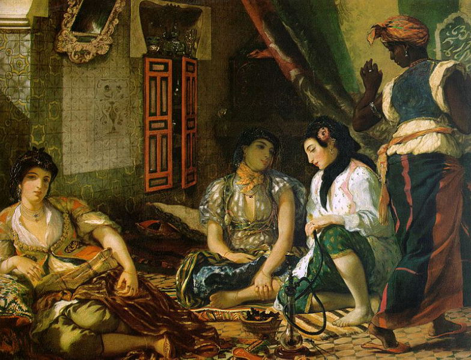

[🏠 Home](../../index.md)

# May 11

## 🧑‍🎨 Painting of the day

[Eugene Delacroix](https://en.wikipedia.org/wiki/Eugène_Delacroix) (Romanticism)

<button class="btn btn-success"
onclick=" window.open('https://lens.google.com/uploadbyurl?url=https://iretes.github.io/one-a-day/data/img/Eugene_Delacroix_2.jpg','_blank')">
Search with Google Lens
</button>

## 🎼 Song of the day

> *Crying*
by Roy Orbison

 Written by Joe Melson, Orbison.

Released in Aug. , 1961.

<button class="btn btn-success"
onclick=" window.open('http://www.youtube.com/search?q=Crying by Roy Orbison','_blank')">
Search on YouTube
</button>

## 🏛️ UNESCO heritage site of the day

> *Vézelay, Church and Hill*, France

Shortly after its foundation in the 9th century, the Benedictine abbey of Vézelay acquired the relics of St Mary Magdalene and since then it has been an important place of pilgrimage. St Bernard preached the Second Crusade there in 1146 and Richard the Lion-Hearted and Philip II Augustus met there to leave for the Third Crusade in 1190. With its sculpted capitals and portal, the Madeleine of Vézelay – a 12th-century monastic church – is a masterpiece of Burgundian Romanesque art and architecture.

<button class="btn btn-success"
onclick=" window.open('http://www.google.com/search?q=Vézelay, Church and Hill','_blank')">
Search on Google
</button>

## 🗺️ Place of the day

<iframe
src="https://www.mapcrunch.com"
name="mapcrunch"
width="500"
height="500"
allowTransparency="true"
scrolling="no"
frameborder="0"
>
</iframe>
## 🎨 Color of the day

> *[Byzantine](https://en.wikipedia.org/wiki/Byzantium_(color)#Byzantine)*

&#9632;

## 🌿 Plant of the day

> *cornelian tree*

<button class="btn btn-success"
onclick=" window.open('http://www.google.com/search?q=cornelian tree','_blank')">
Search on Google
</button>

## 🧑‍🔬 Scientific discovery of the day

> *3rd century BC: Archimedes makes use of infinitesimals.*

<button class="btn btn-success"
onclick=" window.open('http://www.google.com/search?q=3rd century BC: Archimedes makes use of infinitesimals.','_blank')"> 
Search on Google
</button>

## 💭 Philosophical concept of the day

> *[Consent](https://en.wikipedia.org/wiki/Consent)*

## 🗣️ Saying of the day

> *Beer and skittles*

'Beer and skittles' is shorthand for a life of indulgence spent in the pub.

## 🏳️‍🌈 International day

World Migratory Bird Day.