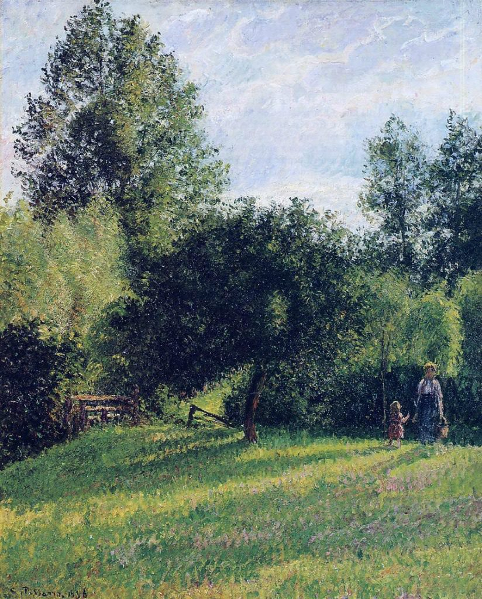

[🏠 Home](../../index.md)

# May 12

## 🧑‍🎨 Painting of the day

[Camille Pissarro](https://en.wikipedia.org/wiki/Camille_Pissarro) (Impressionism, Post-Impressionism)

<button class="btn btn-success"
onclick=" window.open('https://lens.google.com/uploadbyurl?url=https://iretes.github.io/one-a-day/data/img/Camille_Pissarro_7.jpg','_blank')">
Search with Google Lens
</button>

## 🎼 Song of the day

> *Tangled Up in Blue*
by Bob Dylan

 Written by Dylan.

Released in Jan. , 1975.

<button class="btn btn-success"
onclick=" window.open('http://www.youtube.com/search?q=Tangled Up in Blue by Bob Dylan','_blank')">
Search on YouTube
</button>

## 🏛️ UNESCO heritage site of the day

> *Ruins of León Viejo*, Nicaragua

León Viejo is one of the oldest Spanish colonial settlements in the Americas. It did not develop and so its ruins are outstanding testimony to the social and economic structures of the Spanish Empire in the 16th century. Moreover, the site has immense archaeological potential.

<button class="btn btn-success"
onclick=" window.open('http://www.google.com/search?q=Ruins of León Viejo','_blank')">
Search on Google
</button>

## 🗺️ Place of the day

<iframe
src="https://www.mapcrunch.com"
name="mapcrunch"
width="500"
height="500"
allowTransparency="true"
scrolling="no"
frameborder="0"
>
</iframe>
## 🎨 Color of the day

> *[Ultramarine blue](https://en.wikipedia.org/wiki/Ultramarine#Ultramarine_blue)*

&#9632;

## 🌿 Plant of the day

> *multiflora rose*

<button class="btn btn-success"
onclick=" window.open('http://www.google.com/search?q=multiflora rose','_blank')">
Search on Google
</button>

## 🧑‍🔬 Scientific discovery of the day

> *1668: Francesco Redi: disproved idea of spontaneous generation.*

<button class="btn btn-success"
onclick=" window.open('http://www.google.com/search?q=1668: Francesco Redi: disproved idea of spontaneous generation.','_blank')">
Search on Google
</button>

## 💭 Philosophical concept of the day

> *[Samarasa](https://en.wikipedia.org/wiki/Samarasa)*

## 🗣️ Saying of the day

> *Pot calling the kettle black - The *

'The pot calling the kettle black' is a response often given when someone  criticises  another for a fault they also  have themselves.

## 🏳️‍🌈 International day

International Day of Plant Health.