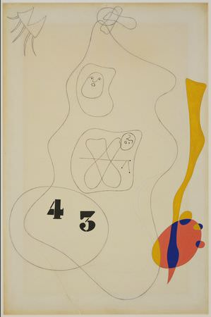

[🏠 Home](../../index.md)

# May 13

## 🧑‍🎨 Painting of the day

[Joan Miro](https://en.wikipedia.org/wiki/Joan_Miró) (Surrealism)

<button class="btn btn-success"
onclick=" window.open('https://lens.google.com/uploadbyurl?url=https://iretes.github.io/one-a-day/data/img/Joan_Miro_4.jpg','_blank')">
Search with Google Lens
</button>

## 🎼 Song of the day

> *Jailhouse Rock*
by Elvis Presley

 Written by Jerry Leiber, Mike Stoller.

Released in Oct. , 1957.

<button class="btn btn-success"
onclick=" window.open('http://www.youtube.com/search?q=Jailhouse Rock by Elvis Presley','_blank')">
Search on YouTube
</button>

## 🏛️ UNESCO heritage site of the day

> *Sulaiman-Too Sacred Mountain*, Kyrgyzstan

Sulaiman-Too Sacred Mountain Kyrgyzstan dominates the Fergana Valley and forms the backdrop to the city of Osh, at the crossroads of important routes on the Central Asian Silk Roads. For more than one and a half millennia, Sulaiman was a beacon for travellers revered as a sacred mountain. Its five peaks and slopes contain numerous ancient places of worship and caves with petroglyphs as well as two largely reconstructed 16th century mosques. One hundred and one sites with petroglyphs representing humans and animals as well as geometrical forms have been indexed in the property so far. The site numbers 17 places of worship, which are still in use, and many that are not. Dispersed around the mountain peaks they are connected by footpaths. The cult sites are believed to provide cures for barrenness, headaches, and back pain and give the blessing of longevity. Veneration for the mountain blends pre-Islamic and Islamic beliefs. The site is believed to represent the most complete example of a sacred mountain anywhere in Central Asia, worshipped over several millennia.

<button class="btn btn-success"
onclick=" window.open('http://www.google.com/search?q=Sulaiman-Too Sacred Mountain','_blank')">
Search on Google
</button>

## 🗺️ Place of the day

<iframe
src="https://www.mapcrunch.com"
name="mapcrunch"
width="500"
height="500"
allowTransparency="true"
scrolling="no"
frameborder="0"
>
</iframe>
## 🎨 Color of the day

> *[Gray (X11 gray)](https://en.wikipedia.org/wiki/X11_color_names#Color_names)*

&#9632;

## 🌿 Plant of the day

> *ragweed*

<button class="btn btn-success"
onclick=" window.open('http://www.google.com/search?q=ragweed','_blank')">
Search on Google
</button>

## 🧑‍🔬 Scientific discovery of the day

> *600 BC: Maharshi Kanada gives the ideal of the smallest units of matter. According to him, matter consisted of indestructible minutes particles called paramanus, which are now called as atoms.*

<button class="btn btn-success"
onclick=" window.open('http://www.google.com/search?q=600 BC: Maharshi Kanada gives the ideal of the smallest units of matter. According to him, matter consisted of indestructible minutes particles called paramanus, which are now called as atoms.','_blank')"> 
Search on Google
</button>

## 💭 Philosophical concept of the day

> *[Simulacrum](https://en.wikipedia.org/wiki/Simulacrum)*

## 🗣️ Saying of the day

> *Carbon-copy*

An exact duplicate. 
