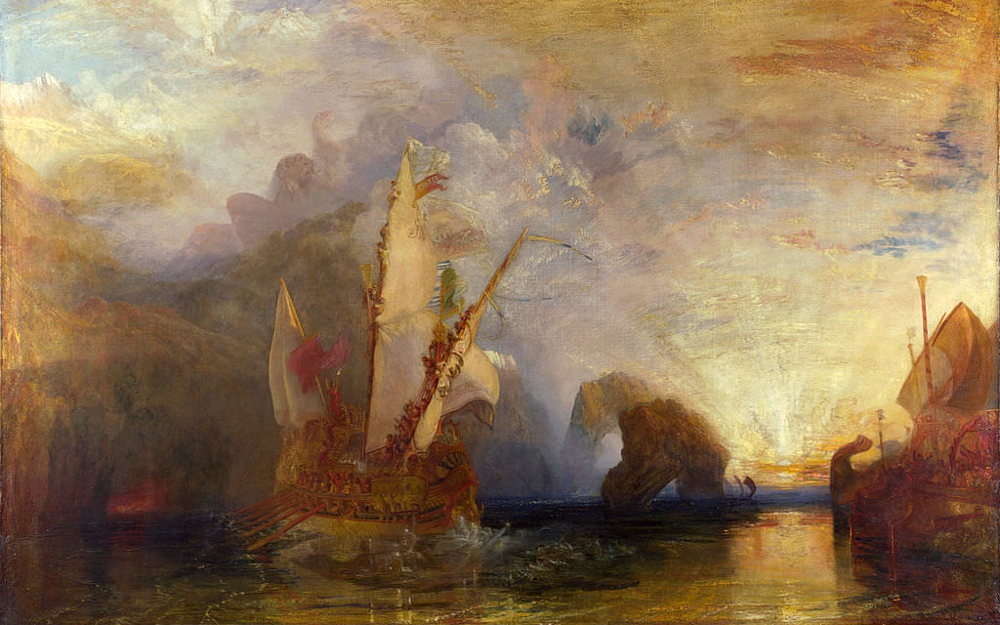

[🏠 Home](../../index.md)

# May 14

## 🧑‍🎨 Painting of the day

[William Turner](https://en.wikipedia.org/wiki/J._M._W._Turner) (Romanticism)

<button class="btn btn-success"
onclick=" window.open('https://lens.google.com/uploadbyurl?url=https://iretes.github.io/one-a-day/data/img/William_Turner_4.jpg','_blank')">
Search with Google Lens
</button>

## 🎼 Song of the day

> *Redemption Song*
by Bob Marley and the Wailers

 Written by Marley.

Released in June , 1980.

<button class="btn btn-success"
onclick=" window.open('http://www.youtube.com/search?q=Redemption Song by Bob Marley and the Wailers','_blank')">
Search on YouTube
</button>

## 🏛️ UNESCO heritage site of the day

> *Historic Centre of San Gimignano*, Italy

'San Gimignano delle belle Torri' is in Tuscany, 56 km south of Florence. It served as an important relay point for pilgrims travelling to or from Rome on the Via Francigena. The patrician families who controlled the town built around 72 tower-houses (some as high as 50 m) as symbols of their wealth and power. Although only 14 have survived, San Gimignano has retained its feudal atmosphere and appearance. The town also has several masterpieces of 14th- and 15th-century Italian art.

<button class="btn btn-success"
onclick=" window.open('http://www.google.com/search?q=Historic Centre of San Gimignano','_blank')">
Search on Google
</button>

## 🗺️ Place of the day

<iframe
src="https://www.mapcrunch.com"
name="mapcrunch"
width="500"
height="500"
allowTransparency="true"
scrolling="no"
frameborder="0"
>
</iframe>
## 🎨 Color of the day

> *[Maize](https://en.wikipedia.org/wiki/Maize_(color))*

&#9632;

## 🌿 Plant of the day

> *serviceberry*

<button class="btn btn-success"
onclick=" window.open('http://www.google.com/search?q=serviceberry','_blank')">
Search on Google
</button>

## 🧑‍🔬 Scientific discovery of the day

> *2017: Gravitational wave signal GW170817 was observed by the LIGO/Virgo collaboration. This was the first instance of a gravitational wave event that was observed to have a simultaneous electromagnetic signal when space telescopes like Hubble observed lights coming from the event, thereby marking a significant breakthrough for multi-messenger astronomy.*

<button class="btn btn-success"
onclick=" window.open('http://www.google.com/search?q=2017: Gravitational wave signal GW170817 was observed by the LIGO/Virgo collaboration. This was the first instance of a gravitational wave event that was observed to have a simultaneous electromagnetic signal when space telescopes like Hubble observed lights coming from the event, thereby marking a significant breakthrough for multi-messenger astronomy.','_blank')">
Search on Google
</button>

## 💭 Philosophical concept of the day

> *[Elegance](https://en.wikipedia.org/wiki/Elegance)*

## 🗣️ Saying of the day

> *Tempest in a teapot*

A tempest in a teapot is a small or insignificant event that is over-reacted to, as if it were of considerably more consequence.
