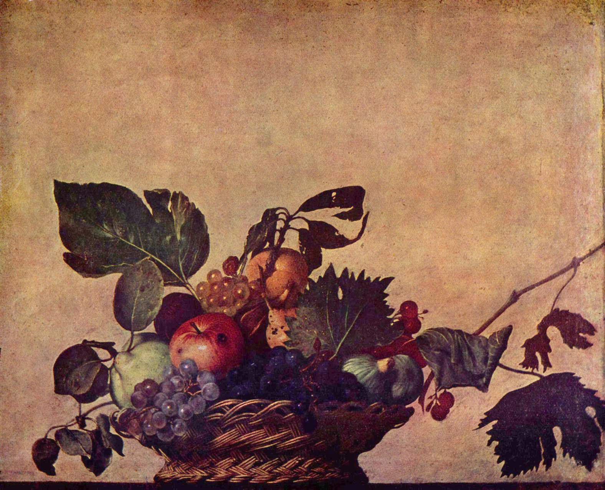

[🏠 Home](../../index.md)

# May 15

## 🧑‍🎨 Painting of the day

[Caravaggio](http://en.wikipedia.org/wiki/Caravaggio) (Baroque)

<button class="btn btn-success"
onclick=" window.open('https://lens.google.com/uploadbyurl?url=https://iretes.github.io/one-a-day/data/img/Caravaggio_3.jpg','_blank')">
Search with Google Lens
</button>

## 🎼 Song of the day

> *Sunshine of Your Love*
by Cream

 Written by Jack Bruce, Pete Brown, Eric Clapton.

Released in Jan. , 1968.

<button class="btn btn-success"
onclick=" window.open('http://www.youtube.com/search?q=Sunshine of Your Love by Cream','_blank')">
Search on YouTube
</button>

## 🏛️ UNESCO heritage site of the day

> *Wachau Cultural Landscape*, Austria

The Wachau is a stretch of the Danube Valley between Melk and Krems, a landscape of high visual quality. It preserves in an intact and visible form many traces - in terms of architecture, (monasteries, castles, ruins), urban design, (towns and villages), and agricultural use, principally for the cultivation of vines - of its evolution since prehistoric times.

<button class="btn btn-success"
onclick=" window.open('http://www.google.com/search?q=Wachau Cultural Landscape','_blank')">
Search on Google
</button>

## 🗺️ Place of the day

<iframe
src="https://www.mapcrunch.com"
name="mapcrunch"
width="500"
height="500"
allowTransparency="true"
scrolling="no"
frameborder="0"
>
</iframe>
## 🎨 Color of the day

> *[Tyrian purple](https://en.wikipedia.org/wiki/Tyrian_purple#Tyrian_purple)*

&#9632;

## 🌿 Plant of the day

> *american white hellebore*

<button class="btn btn-success"
onclick=" window.open('http://www.google.com/search?q=american white hellebore','_blank')">
Search on Google
</button>

## 🧑‍🔬 Scientific discovery of the day

> *1952: Frederick Sanger: demonstrated that proteins are sequences of amino acids*

<button class="btn btn-success"
onclick=" window.open('http://www.google.com/search?q=1952: Frederick Sanger: demonstrated that proteins are sequences of amino acids','_blank')"> 
Search on Google
</button>

## 💭 Philosophical concept of the day

> *[Reference](https://en.wikipedia.org/wiki/Reference)*

## 🗣️ Saying of the day

> *As easy as pie *

Very easy.

## 🏳️‍🌈 International day

International Day of Families.