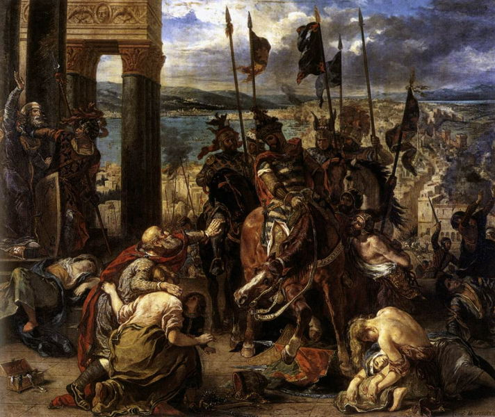

[🏠 Home](../../index.md)

# May 16

## 🧑‍🎨 Painting of the day

[Eugene Delacroix](https://en.wikipedia.org/wiki/Eugène_Delacroix) (Romanticism)

<button class="btn btn-success"
onclick=" window.open('https://lens.google.com/uploadbyurl?url=https://iretes.github.io/one-a-day/data/img/Eugene_Delacroix_6.jpg','_blank')">
Search with Google Lens
</button>

## 🎼 Song of the day

> *She Loves You*
by The Beatles

 Written by John Lennon, Paul McCartney .

Released in Sept. , 1963.

<button class="btn btn-success"
onclick=" window.open('http://www.youtube.com/search?q=She Loves You by The Beatles','_blank')">
Search on YouTube
</button>

## 🏛️ UNESCO heritage site of the day

> *Imperial Palaces of the Ming and Qing Dynasties in Beijing and Shenyang*, China

Seat of supreme power for over five centuries (1416-1911), the Forbidden City in Beijing, with its landscaped gardens and many buildings (whose nearly 10,000 rooms contain furniture and works of art), constitutes a priceless testimony to Chinese civilization during the Ming and Qing dynasties. The Imperial Palace of the Qing Dynasty in Shenyang consists of 114 buildings constructed between 1625–26 and 1783. It contains an important library and testifies to the foundation of the last dynasty that ruled China, before it expanded its power to the centre of the country and moved the capital to Beijing. This palace then became auxiliary to the Imperial Palace in Beijing. This remarkable architectural edifice offers important historical testimony to the history of the Qing Dynasty and to the cultural traditions of the Manchu and other tribes in the north of China.

<button class="btn btn-success"
onclick=" window.open('http://www.google.com/search?q=Imperial Palaces of the Ming and Qing Dynasties in Beijing and Shenyang','_blank')">
Search on Google
</button>

## 🗺️ Place of the day

<iframe
src="https://www.mapcrunch.com"
name="mapcrunch"
width="500"
height="500"
allowTransparency="true"
scrolling="no"
frameborder="0"
>
</iframe>
## 🎨 Color of the day

> *[Light goldenrod yellow](https://en.wikipedia.org/wiki/Goldenrod_(color)#Light_goldenrod_yellow)*

&#9632;

## 🌿 Plant of the day

> *lambs foot*

<button class="btn btn-success"
onclick=" window.open('http://www.google.com/search?q=lambs foot','_blank')">
Search on Google
</button>

## 🧑‍🔬 Scientific discovery of the day

> *1871: Lord Rayleigh: Diffuse sky radiation (Rayleigh scattering) explains why sky appears blue.*

<button class="btn btn-success"
onclick=" window.open('http://www.google.com/search?q=1871: Lord Rayleigh: Diffuse sky radiation (Rayleigh scattering) explains why sky appears blue.','_blank')"> 
Search on Google
</button>

## 💭 Philosophical concept of the day

> *[Jus sanguinis](https://en.wikipedia.org/wiki/Jus_sanguinis)*

## 🗣️ Saying of the day

> *Knuckle down*

Get down to work and apply oneself earnestly to it. 

## 🏳️‍🌈 International day

International Day of Living Together in Peace, International Day of Light.