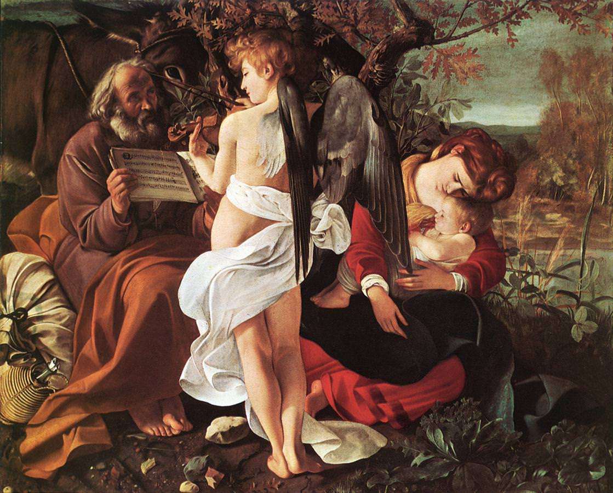

[🏠 Home](../../index.md)

# May 17

## 🧑‍🎨 Painting of the day

[Caravaggio](http://en.wikipedia.org/wiki/Caravaggio) (Baroque)

<button class="btn btn-success"
onclick=" window.open('https://lens.google.com/uploadbyurl?url=https://iretes.github.io/one-a-day/data/img/Caravaggio_5.jpg','_blank')">
Search with Google Lens
</button>

## 🎼 Song of the day

> *For What Its Worth*
by Buffalo Springfield

 Written by Stephen Stills.

Released in Feb. , 1967.

<button class="btn btn-success"
onclick=" window.open('http://www.youtube.com/search?q=For What Its Worth by Buffalo Springfield','_blank')">
Search on YouTube
</button>

## 🏛️ UNESCO heritage site of the day

> *Struve Geodetic Arc*, Belarus,Estonia,Finland,Latvia,Lithuania,Norway,Republic of Moldova,Russian Federation,Sweden,Ukraine

The Struve Arc is a chain of survey triangulations stretching from Hammerfest in Norway to the Black Sea, through 10 countries and over 2,820 km. These are points of a survey, carried out between 1816 and 1855 by the astronomer Friedrich Georg Wilhelm Struve, which represented the first accurate measuring of a long segment of a meridian. This helped to establish the exact size and shape of the planet and marked an important step in the development of earth sciences and topographic mapping. It is an extraordinary example of scientific collaboration among scientists from different countries, and of collaboration between monarchs for a scientific cause. The original arc consisted of 258 main triangles with 265 main station points. The listed site includes 34 of the original station points, with different markings, i.e. a drilled hole in rock, iron cross, cairns, or built obelisks.

<button class="btn btn-success"
onclick=" window.open('http://www.google.com/search?q=Struve Geodetic Arc','_blank')">
Search on Google
</button>

## 🗺️ Place of the day

<iframe
src="https://www.mapcrunch.com"
name="mapcrunch"
width="500"
height="500"
allowTransparency="true"
scrolling="no"
frameborder="0"
>
</iframe>
## 🎨 Color of the day

> *[Electric lime](https://en.wikipedia.org/wiki/Lime_(color)#Electric_lime)*

&#9632;

## 🌿 Plant of the day

> *korean rock fern*

<button class="btn btn-success"
onclick=" window.open('http://www.google.com/search?q=korean rock fern','_blank')">
Search on Google
</button>

## 🧑‍🔬 Scientific discovery of the day

> *1837: Charles Babbage proposes a design for the construction of a Turing complete, general purpose Computer, to be called the Analytical Engine.*

<button class="btn btn-success"
onclick=" window.open('http://www.google.com/search?q=1837: Charles Babbage proposes a design for the construction of a Turing complete, general purpose Computer, to be called the Analytical Engine.','_blank')"> 
Search on Google
</button>

## 💭 Philosophical concept of the day

> *[Mantra](https://en.wikipedia.org/wiki/Mantra)*

## 🗣️ Saying of the day

> *Everybody out*

An injunction to workers to 'down tools' come out on strike.

## 🏳️‍🌈 International day

World Telecommunication and Information Society Day.