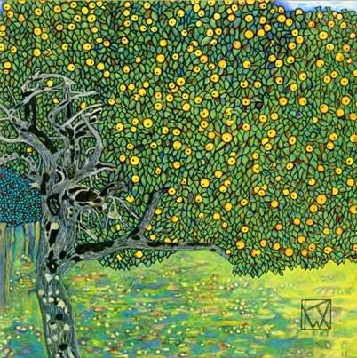

[🏠 Home](../../index.md)

# May 18

## 🧑‍🎨 Painting of the day

[Gustav Klimt](http://en.wikipedia.org/wiki/Gustav_Klimt) (Symbolism, Art Nouveau)

<button class="btn btn-success"
onclick=" window.open('https://lens.google.com/uploadbyurl?url=https://iretes.github.io/one-a-day/data/img/Gustav_Klimt_6.jpg','_blank')">
Search with Google Lens
</button>

## 🎼 Song of the day

> *Bo Diddley*
by Bo Diddley

 Written by Ellas McDaniel.

Released in June , 1955.

<button class="btn btn-success"
onclick=" window.open('http://www.youtube.com/search?q=Bo Diddley by Bo Diddley','_blank')">
Search on YouTube
</button>

## 🏛️ UNESCO heritage site of the day

> *Chaco Culture*, United States of America

For over 2,000 years, Pueblo peoples occupied a vast region of the south-western United States. Chaco Canyon, a major centre of ancestral Pueblo culture between 850 and 1250, was a focus for ceremonials, trade and political activity for the prehistoric Four Corners area. Chaco is remarkable for its monumental public and ceremonial buildings and its distinctive architecture – it has an ancient urban ceremonial centre that is unlike anything constructed before or since. In addition to the Chaco Culture National Historical Park, the World Heritage property includes the Aztec Ruins National Monument and several smaller Chaco sites managed by the Bureau of Land Management.

<button class="btn btn-success"
onclick=" window.open('http://www.google.com/search?q=Chaco Culture','_blank')">
Search on Google
</button>

## 🗺️ Place of the day

<iframe
src="https://www.mapcrunch.com"
name="mapcrunch"
width="500"
height="500"
allowTransparency="true"
scrolling="no"
frameborder="0"
>
</iframe>
## 🎨 Color of the day

> *[Opal](https://en.wikipedia.org/wiki/Shades_of_gray#Opal)*

&#9632;

## 🌿 Plant of the day

> *sweet potato vine*

<button class="btn btn-success"
onclick=" window.open('http://www.google.com/search?q=sweet potato vine','_blank')">
Search on Google
</button>

## 🧑‍🔬 Scientific discovery of the day

> *1865: Rudolf Clausius: Definition of entropy.*

<button class="btn btn-success"
onclick=" window.open('http://www.google.com/search?q=1865: Rudolf Clausius: Definition of entropy.','_blank')">
Search on Google
</button>

## 💭 Philosophical concept of the day

> *[Propositional attitude](https://en.wikipedia.org/wiki/Propositional_attitude)*

## 🗣️ Saying of the day

> *Give a man a fish and you will feed him for a day*

This proverbial saying  suggests that the ability to work is of greater benefit than a one-off handout.
