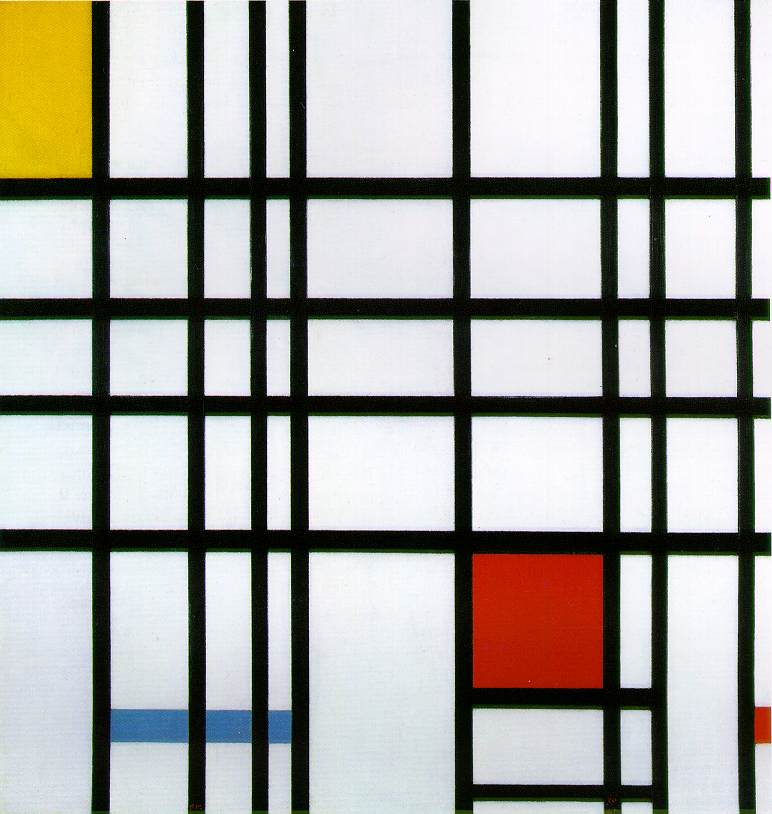

[🏠 Home](../../index.md)

# May 19

## 🧑‍🎨 Painting of the day

[Piet Mondrian](https://en.wikipedia.org/wiki/Piet_Mondrian) (Neoplasticism)

<button class="btn btn-success"
onclick=" window.open('https://lens.google.com/uploadbyurl?url=https://iretes.github.io/one-a-day/data/img/Piet_Mondrian_7.jpg','_blank')">
Search with Google Lens
</button>

## 🎼 Song of the day

> *Whole Lotta Shakin Going On*
by Jerry Lee Lewis

 Written by Dave Williams, Roy Hall.

Released in June , 1957.

<button class="btn btn-success"
onclick=" window.open('http://www.youtube.com/search?q=Whole Lotta Shakin Going On by Jerry Lee Lewis','_blank')">
Search on YouTube
</button>

## 🏛️ UNESCO heritage site of the day

> *Historic Centre of Salvador de Bahia*, Brazil

As the first capital of Brazil, from 1549 to 1763, Salvador de Bahia witnessed the blending of European, African and Amerindian cultures. It was also, from 1558, the first slave market in the New World, with slaves arriving to work on the sugar plantations. The city has managed to preserve many outstanding Renaissance buildings. A special feature of the old town are the brightly coloured houses, often decorated with fine stucco-work.

<button class="btn btn-success"
onclick=" window.open('http://www.google.com/search?q=Historic Centre of Salvador de Bahia','_blank')">
Search on Google
</button>

## 🗺️ Place of the day

<iframe
src="https://www.mapcrunch.com"
name="mapcrunch"
width="500"
height="500"
allowTransparency="true"
scrolling="no"
frameborder="0"
>
</iframe>
## 🎨 Color of the day

> *[Air superiority blue](https://en.wikipedia.org/wiki/Air_Force_blue#Air_superiority_blue/PRU_blue)*

&#9632;

## 🌿 Plant of the day

> *red osier*

<button class="btn btn-success"
onclick=" window.open('http://www.google.com/search?q=red osier','_blank')">
Search on Google
</button>

## 🧑‍🔬 Scientific discovery of the day

> *12th century: Jewish polymath Baruch ben Malka in Iraq formulates a qualitative form of Newton's second law for constant forces.*

<button class="btn btn-success"
onclick=" window.open('http://www.google.com/search?q=12th century: Jewish polymath Baruch ben Malka in Iraq formulates a qualitative form of Newton s second law for constant forces.','_blank')">
Search on Google
</button>

## 💭 Philosophical concept of the day

> *[Dogma](https://en.wikipedia.org/wiki/Dogma)*

## 🗣️ Saying of the day

> *Taken for a ride*

To be 'taken for a ride' is to be deliberately misled or cheated. Alternatively, and primarily in the USA, it means to be  abducted in a vehicle and murdered.
