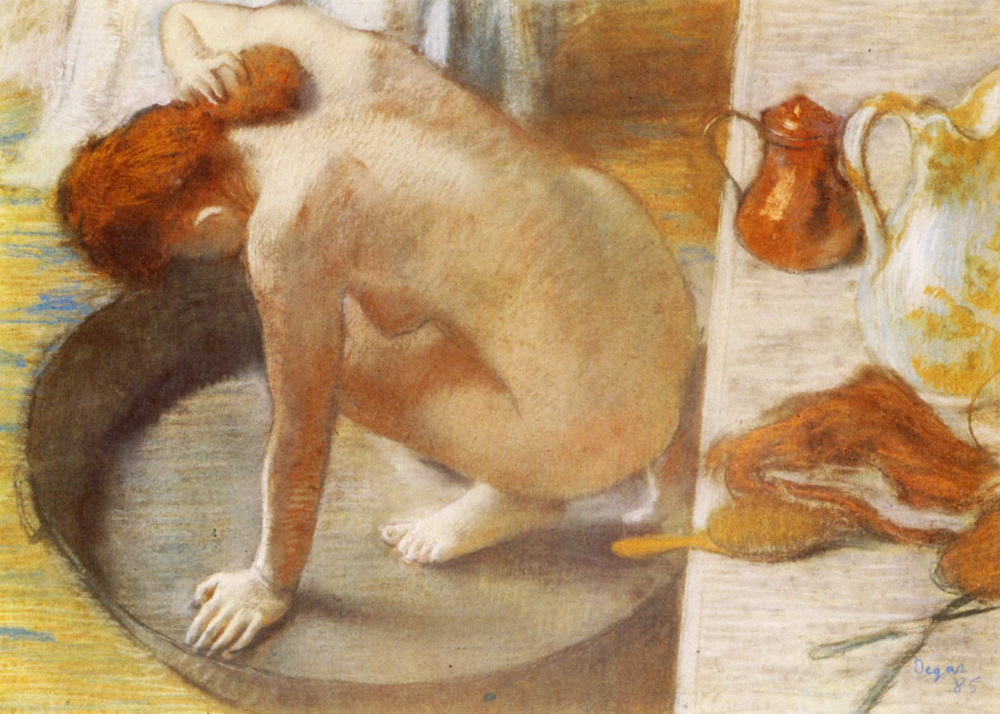

[🏠 Home](../../index.md)

# May 2

## 🧑‍🎨 Painting of the day

[Edgar Degas](http://en.wikipedia.org/wiki/Edgar_Degas) (Impressionism)

<button class="btn btn-success"
onclick=" window.open('https://lens.google.com/uploadbyurl?url=https://iretes.github.io/one-a-day/data/img/Edgar_Degas_7.jpg','_blank')">
Search with Google Lens
</button>

## 🎼 Song of the day

> *I Got You (I Feel Good)*
by James Brown

 Written by Brown.

Released in Nov. , 1965.

<button class="btn btn-success"
onclick=" window.open('http://www.youtube.com/search?q=I Got You (I Feel Good) by James Brown','_blank')">
Search on YouTube
</button>

## 🏛️ UNESCO heritage site of the day

> *The Four Lifts on the Canal du Centre and their Environs, La Louvière and Le Roeulx (Hainaut)*, Belgium

The four hydraulic boat-lifts on this short stretch of the historic Canal du Centre are industrial monuments of the highest quality. Together with the canal itself and its associated structures, they constitute a remarkably well-preserved and complete example of a late-19th-century industrial landscape. Of the eight hydraulic boat-lifts built at the end of the 19th and beginning of the 20th century, the only ones in the world which still exist in their original working condition are these four lifts on the Canal du Centre.

<button class="btn btn-success"
onclick=" window.open('http://www.google.com/search?q=The Four Lifts on the Canal du Centre and their Environs, La Louvière and Le Roeulx (Hainaut)','_blank')">
Search on Google
</button>

## 🗺️ Place of the day

<iframe
src="https://www.mapcrunch.com"
name="mapcrunch"
width="500"
height="500"
allowTransparency="true"
scrolling="no"
frameborder="0"
>
</iframe>
## 🎨 Color of the day

> *[Lion](https://en.wikipedia.org/wiki/Lion_(color))*

&#9632;

## 🌿 Plant of the day

> *white mans foot*

<button class="btn btn-success"
onclick=" window.open('http://www.google.com/search?q=white mans foot','_blank')">
Search on Google
</button>

## 🧑‍🔬 Scientific discovery of the day

> *2023: On 18 July, Voyager 2 overtook Pioneer 10 as the second farthest spacecraft from the Sun at the distance 133.92 AU (nearly 12,45 billion miles) from the Sun.*

<button class="btn btn-success"
onclick=" window.open('http://www.google.com/search?q=2023: On 18 July, Voyager 2 overtook Pioneer 10 as the second farthest spacecraft from the Sun at the distance 133.92 AU (nearly 12,45 billion miles) from the Sun.','_blank')">
Search on Google
</button>

## 💭 Philosophical concept of the day

> *[Political consciousness](https://en.wikipedia.org/wiki/Political_consciousness)*

## 🗣️ Saying of the day

> *As cool as a cucumber*

'As cool as a cucumber' means calm and unruffled.

## 🏳️‍🌈 International day

World Tuna Day.