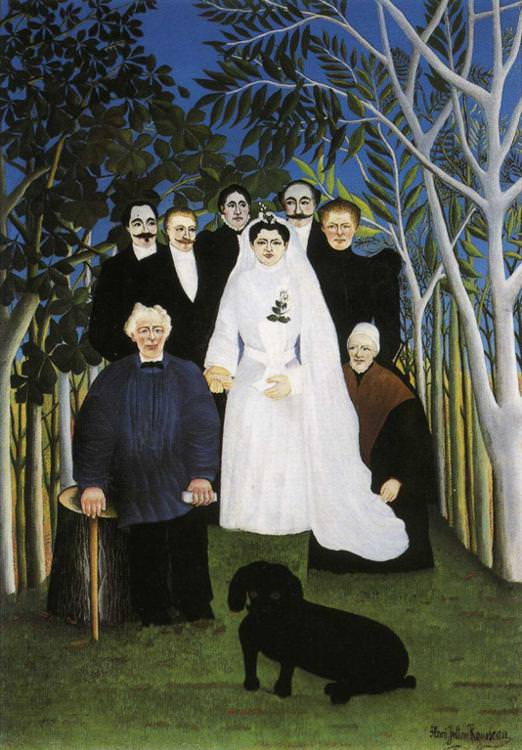

[🏠 Home](../../index.md)

# May 20

## 🧑‍🎨 Painting of the day

[Henri Rousseau](https://en.wikipedia.org/wiki/Henri_Rousseau) (Primitivism)

<button class="btn btn-success"
onclick=" window.open('https://lens.google.com/uploadbyurl?url=https://iretes.github.io/one-a-day/data/img/Henri_Rousseau_2.jpg','_blank')">
Search with Google Lens
</button>

## 🎼 Song of the day

> *Lets Stay Together*
by Al Green

 Written by Al Green, Al Jackson Jr., Willie Mitchell.

Released in Dec. , 1971.

<button class="btn btn-success"
onclick=" window.open('http://www.youtube.com/search?q=Lets Stay Together by Al Green','_blank')">
Search on YouTube
</button>

## 🏛️ UNESCO heritage site of the day

> *Risco Caido and the Sacred Mountains of Gran Canaria Cultural Landscape*, Spain

Located in a vast mountainous area in the centre of Gran Canaria, Risco Caído comprises cliffs, ravines and volcanic formations in a landscape of rich biodiversity. The landscape includes a large number of troglodyte settlements — habitats, granaries and cisterns — whose age is proof of the presence of a pre-Hispanic culture on the island, which has evolved in isolation, from the arrival of North African Berbers, around the beginning of our era, until the first Spanish settlers in the 15th century. The troglodyte complex also includes cult cavities and two sacred temples, or <em>almogarenes </em>— Risco Caído and Roque Bentayga — where seasonal ceremonies were held. These temples are thought to be linked to a possible cult of the stars and Mother Earth.

<button class="btn btn-success"
onclick=" window.open('http://www.google.com/search?q=Risco Caido and the Sacred Mountains of Gran Canaria Cultural Landscape','_blank')">
Search on Google
</button>

## 🗺️ Place of the day

<iframe
src="https://www.mapcrunch.com"
name="mapcrunch"
width="500"
height="500"
allowTransparency="true"
scrolling="no"
frameborder="0"
>
</iframe>
## 🎨 Color of the day

> *[Green (Pantone)](https://en.wikipedia.org/wiki/Shades_of_green#Green_(Pantone))*

&#9632;

## 🌿 Plant of the day

> *garlic root*

<button class="btn btn-success"
onclick=" window.open('http://www.google.com/search?q=garlic root','_blank')">
Search on Google
</button>

## 🧑‍🔬 Scientific discovery of the day

> *2000 BC: Pythagorean triples are first discussed in Babylon and Egypt, and appear on later manuscripts such as the Berlin Papyrus 6619.*

<button class="btn btn-success"
onclick=" window.open('http://www.google.com/search?q=2000 BC: Pythagorean triples are first discussed in Babylon and Egypt, and appear on later manuscripts such as the Berlin Papyrus 6619.','_blank')">
Search on Google
</button>

## 💭 Philosophical concept of the day

> *[Primum non nocere](https://en.wikipedia.org/wiki/Primum_non_nocere)*

## 🗣️ Saying of the day

> *A woman needs a man like a fish needs a bicycle*

"A woman needs a man like a fish needs a bicycle" is a
feminist slogan, humorously expressing the view that a woman can live her life perfectly well without a man. 

## 🏳️‍🌈 International day

World Bee Day.