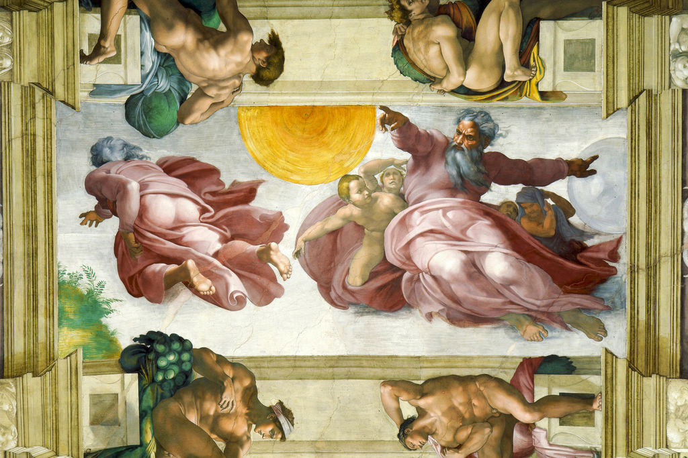

[🏠 Home](../../index.md)

# May 22

## 🧑‍🎨 Painting of the day

[Michelangelo](https://en.wikipedia.org/wiki/Michelangelo) (High Renaissance)

<button class="btn btn-success"
onclick=" window.open('https://lens.google.com/uploadbyurl?url=https://iretes.github.io/one-a-day/data/img/Michelangelo_1.jpg','_blank')">
Search with Google Lens
</button>

## 🎼 Song of the day

> *Billie Jean*
by Michael Jackson

 Written by Jackson.

Released in Jan. , 1983.

<button class="btn btn-success"
onclick=" window.open('http://www.youtube.com/search?q=Billie Jean by Michael Jackson','_blank')">
Search on YouTube
</button>

## 🏛️ UNESCO heritage site of the day

> *Jesuit Missions of the Guaranis: San Ignacio Mini, Santa Ana, Nuestra Señora de Loreto and Santa Maria Mayor (Argentina), Ruins of Sao Miguel das Missoes (Brazil)*, Argentina,Brazil

The ruins of São Miguel das Missões in Brazil, and those of San Ignacio Miní, Santa Ana, Nuestra Señora de Loreto and Santa María la Mayor in Argentina, lie at the heart of a tropical forest. They are the impressive remains of five Jesuit missions, built in the land of the Guaranis during the 17th and 18th centuries. Each is characterized by a specific layout and a different state of conservation.

<button class="btn btn-success"
onclick=" window.open('http://www.google.com/search?q=Jesuit Missions of the Guaranis: San Ignacio Mini, Santa Ana, Nuestra Señora de Loreto and Santa Maria Mayor (Argentina), Ruins of Sao Miguel das Missoes (Brazil)','_blank')">
Search on Google
</button>

## 🗺️ Place of the day

<iframe
src="https://www.mapcrunch.com"
name="mapcrunch"
width="500"
height="500"
allowTransparency="true"
scrolling="no"
frameborder="0"
>
</iframe>
## 🎨 Color of the day

> *[Maximum yellow](https://en.wikipedia.org/wiki/Shades_of_yellow#Maximum_yellow)*

&#9632;

## 🌿 Plant of the day

> *inkberry holly*

<button class="btn btn-success"
onclick=" window.open('http://www.google.com/search?q=inkberry holly','_blank')">
Search on Google
</button>

## 🧑‍🔬 Scientific discovery of the day

> *3rd century BC: Archimedes calculates areas and volumes relating to conic sections, such as the area bounded between a parabola and a chord, and various volumes of revolution.*

<button class="btn btn-success"
onclick=" window.open('http://www.google.com/search?q=3rd century BC: Archimedes calculates areas and volumes relating to conic sections, such as the area bounded between a parabola and a chord, and various volumes of revolution.','_blank')"> 
Search on Google
</button>

## 💭 Philosophical concept of the day

> *[Minority](https://en.wikipedia.org/wiki/Minority_(philosophy))*

## 🗣️ Saying of the day

> *Put on your thinking cap*

Take time for consideration of some question.

## 🏳️‍🌈 International day

International Day for Biological Diversity.