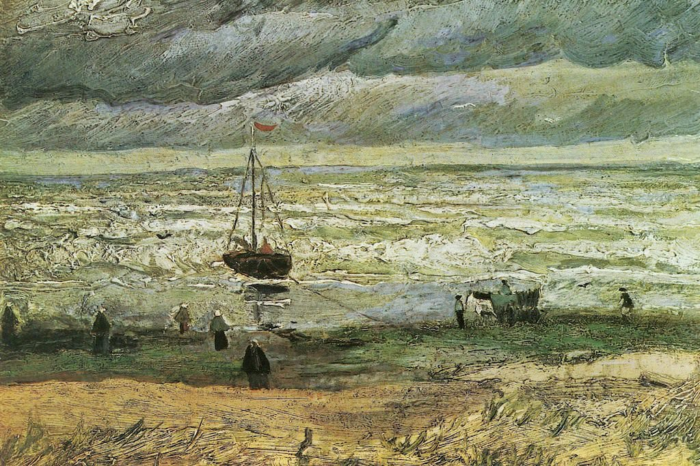

[🏠 Home](../../index.md)

# May 23

## 🧑‍🎨 Painting of the day

[Vincent van Gogh](http://en.wikipedia.org/wiki/Vincent_van_Gogh) (Post-Impressionism)

<button class="btn btn-success"
onclick=" window.open('https://lens.google.com/uploadbyurl?url=https://iretes.github.io/one-a-day/data/img/Vincent_van_Gogh_6.jpg','_blank')">
Search with Google Lens
</button>

## 🎼 Song of the day

> *Whiter Shade of Pale*
by Procol Harum

 Written by Keith Reid, Gary Brooker.

Released in June , 1967.

<button class="btn btn-success"
onclick=" window.open('http://www.youtube.com/search?q=Whiter Shade of Pale by Procol Harum','_blank')">
Search on YouTube
</button>

## 🏛️ UNESCO heritage site of the day

> *Carolingian Westwork and Civitas Corvey*, Germany

The site is located along the Weser River on the outskirts of Höxter where the Carolingian Westwork and Civitas Corvey were erected between AD 822 and 885 in a largely preserved rural setting. The Westwork is the only standing structure that dates back to the Carolingian era, while the original imperial abbey complex is preserved as archaeological remains that are only partially excavated. The Westwork of Corvey uniquely illustrates one of the most important Carolingian architectural expressions. It is a genuine creation of this period, and its architectural articulation and decoration clearly illustrate the role played within the Frankish empire by imperial monasteries in securing territorial control and administration, as well as the propagation of Christianity and the Carolingian cultural and political order throughout Europe.

<button class="btn btn-success"
onclick=" window.open('http://www.google.com/search?q=Carolingian Westwork and Civitas Corvey','_blank')">
Search on Google
</button>

## 🗺️ Place of the day

<iframe
src="https://www.mapcrunch.com"
name="mapcrunch"
width="500"
height="500"
allowTransparency="true"
scrolling="no"
frameborder="0"
>
</iframe>
## 🎨 Color of the day

> *[Indigo dye](https://en.wikipedia.org/wiki/Indigo#Indigo_dye)*

&#9632;

## 🌿 Plant of the day

> *valley oak*

<button class="btn btn-success"
onclick=" window.open('http://www.google.com/search?q=valley oak','_blank')">
Search on Google
</button>

## 🧑‍🔬 Scientific discovery of the day

> *2020: The Double Asteroid Redirection Test (DART) successfully made contact with Dimorphos, in a test operated by NASA to test potential planetary defense to near-Earth objects.*

<button class="btn btn-success"
onclick=" window.open('http://www.google.com/search?q=2020: The Double Asteroid Redirection Test (DART) successfully made contact with Dimorphos, in a test operated by NASA to test potential planetary defense to near-Earth objects.','_blank')"> 
Search on Google
</button>

## 💭 Philosophical concept of the day

> *[Construct](https://en.wikipedia.org/wiki/Construct_(philosophy_of_science))*

## 🗣️ Saying of the day

> *Shilly-shally*

To dither and be undecided.

## 🏳️‍🌈 International day

Vesak, the Day of the Full Moon, International Day to End Obstetric Fistula.