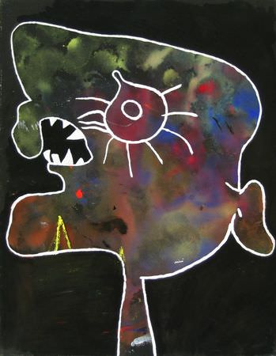

[🏠 Home](../../index.md)

# May 25

## 🧑‍🎨 Painting of the day

[Joan Miro](https://en.wikipedia.org/wiki/Joan_Miró) (Surrealism)

<button class="btn btn-success"
onclick=" window.open('https://lens.google.com/uploadbyurl?url=https://iretes.github.io/one-a-day/data/img/Joan_Miro_7.jpg','_blank')">
Search with Google Lens
</button>

## 🎼 Song of the day

> *Long Tall Sally*
by Little Richard

 Written by Robert "Bumps" Blackwell, Enotris Johnson, Little Richard.

Released in March , 1956.

<button class="btn btn-success"
onclick=" window.open('http://www.youtube.com/search?q=Long Tall Sally by Little Richard','_blank')">
Search on YouTube
</button>

## 🏛️ UNESCO heritage site of the day

> *Paphos*, Cyprus

Paphos has been inhabited since the Neolithic period. It was a centre of the cult of Aphrodite and of pre-Hellenic fertility deities. Aphrodite's legendary birthplace was on this island, where her temple was erected by the Myceneans in the 12th century B.C. The remains of villas, palaces, theatres, fortresses and tombs mean that the site is of exceptional architectural and historic value. The mosaics of Nea Paphos are among the most beautiful in the world.

<button class="btn btn-success"
onclick=" window.open('http://www.google.com/search?q=Paphos','_blank')">
Search on Google
</button>

## 🗺️ Place of the day

<iframe
src="https://www.mapcrunch.com"
name="mapcrunch"
width="500"
height="500"
allowTransparency="true"
scrolling="no"
frameborder="0"
>
</iframe>
## 🎨 Color of the day

> *[Mint](https://en.wikipedia.org/wiki/Spring_green_(color)#Mint)*

&#9632;

## 🌿 Plant of the day

> *speedwell*

<button class="btn btn-success"
onclick=" window.open('http://www.google.com/search?q=speedwell','_blank')">
Search on Google
</button>

## 🧑‍🔬 Scientific discovery of the day

> *1873: Frederick Guthrie discovers thermionic emission.*

<button class="btn btn-success"
onclick=" window.open('http://www.google.com/search?q=1873: Frederick Guthrie discovers thermionic emission.','_blank')"> 
Search on Google
</button>

## 💭 Philosophical concept of the day

> *[Material cause](https://en.wikipedia.org/wiki/Material_cause)*

## 🗣️ Saying of the day

> *The whole nine yards*

The expression 'the whole nine yards' means 'all of it - the full measure'.

## 🏳️‍🌈 International day

Week of Solidarity with the Peoples of Non-Self-Governing Territories (25-31 May).