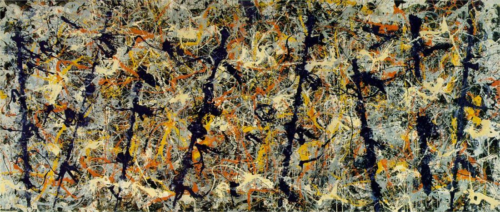

[🏠 Home](../../index.md)

# May 26

## 🧑‍🎨 Painting of the day

[Jackson Pollock](http://en.wikipedia.org/wiki/Jackson_Pollock) (Abstract Expressionism)

<button class="btn btn-success"
onclick=" window.open('https://lens.google.com/uploadbyurl?url=https://iretes.github.io/one-a-day/data/img/Jackson_Pollock_3.jpg','_blank')">
Search with Google Lens
</button>

## 🎼 Song of the day

> *Louie Louie*
by The Kingsmen

 Written by Richard Berry.

Released in June , 1963.

<button class="btn btn-success"
onclick=" window.open('http://www.youtube.com/search?q=Louie Louie by The Kingsmen','_blank')">
Search on YouTube
</button>

## 🏛️ UNESCO heritage site of the day

> *Ferrara, City of the Renaissance, and its Po Delta*, Italy

Ferrara, which grew up around a ford over the River Po, became an intellectual and artistic centre that attracted the greatest minds of the Italian Renaissance in the 15th and 16th centuries. Here, Piero della Francesca, Jacopo Bellini and Andrea Mantegna decorated the palaces of the House of Este. The humanist concept of the 'ideal city' came to life here in the neighbourhoods built from 1492 onwards by Biagio Rossetti according to the new principles of perspective. The completion of this project marked the birth of modern town planning and influenced its subsequent development.

<button class="btn btn-success"
onclick=" window.open('http://www.google.com/search?q=Ferrara, City of the Renaissance, and its Po Delta','_blank')">
Search on Google
</button>

## 🗺️ Place of the day

<iframe
src="https://www.mapcrunch.com"
name="mapcrunch"
width="500"
height="500"
allowTransparency="true"
scrolling="no"
frameborder="0"
>
</iframe>
## 🎨 Color of the day

> *[Jasmine](https://en.wikipedia.org/wiki/Jasmine_(color))*

&#9632;

## 🌿 Plant of the day

> *spotted deadnettle*

<button class="btn btn-success"
onclick=" window.open('http://www.google.com/search?q=spotted deadnettle','_blank')">
Search on Google
</button>

## 🧑‍🔬 Scientific discovery of the day

> *By the 4th century: The present Hindu–Arabic numeral system with place-value numerals develops in Gupta-era India, and is attested in the Bakhshali Manuscript of Gandhara. The superiority of the system over existing place-value and sign-value systems arises from its treatment of zero as an ordinary numeral.*

<button class="btn btn-success"
onclick=" window.open('http://www.google.com/search?q=By the 4th century: The present Hindu–Arabic numeral system with place-value numerals develops in Gupta-era India, and is attested in the Bakhshali Manuscript of Gandhara. The superiority of the system over existing place-value and sign-value systems arises from its treatment of zero as an ordinary numeral.','_blank')"> 
Search on Google
</button>

## 💭 Philosophical concept of the day

> *[Empirical research](https://en.wikipedia.org/wiki/Empirical_research)*

## 🗣️ Saying of the day

> *Eat my hat*

A display of confidence in a particular outcome; for example, 'She's always late. If she gets that train I'll eat my hat'.
