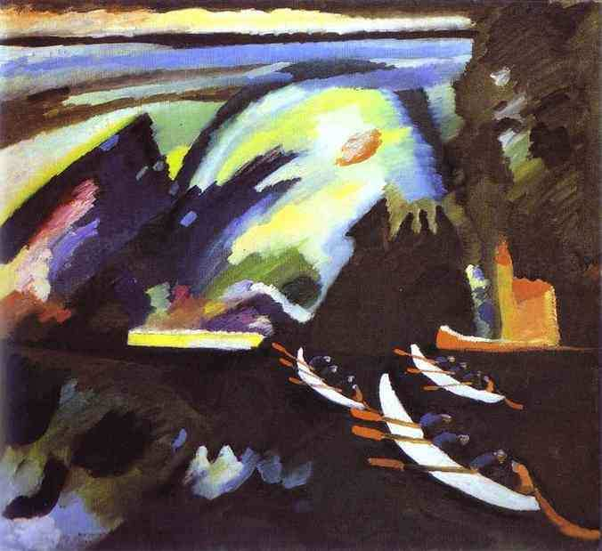

[🏠 Home](../../index.md)

# May 27

## 🧑‍🎨 Painting of the day

[Vasiliy Kandinskiy](http://en.wikipedia.org/wiki/Wassily_Kandinsky) (Expressionism, Abstractionism)

<button class="btn btn-success"
onclick=" window.open('https://lens.google.com/uploadbyurl?url=https://iretes.github.io/one-a-day/data/img/Vasiliy_Kandinskiy_2.jpg','_blank')">
Search with Google Lens
</button>

## 🎼 Song of the day

> *When a Man Loves a Woman*
by Percy Sledge

 Written by Calvin Lewis, Andrew Wright.

Released in March , 1966.

<button class="btn btn-success"
onclick=" window.open('http://www.youtube.com/search?q=When a Man Loves a Woman by Percy Sledge','_blank')">
Search on YouTube
</button>

## 🏛️ UNESCO heritage site of the day

> *Memphis and its Necropolis – the Pyramid Fields from Giza to Dahshur*, Egypt

The capital of the Old Kingdom of Egypt has some extraordinary funerary monuments, including rock tombs, ornate mastabas, temples and pyramids. In ancient times, the site was considered one of the Seven Wonders of the World.

<button class="btn btn-success"
onclick=" window.open('http://www.google.com/search?q=Memphis and its Necropolis – the Pyramid Fields from Giza to Dahshur','_blank')">
Search on Google
</button>

## 🗺️ Place of the day

<iframe
src="https://www.mapcrunch.com"
name="mapcrunch"
width="500"
height="500"
allowTransparency="true"
scrolling="no"
frameborder="0"
>
</iframe>
## 🎨 Color of the day

> *[Blue yonder](https://en.wikipedia.org/wiki/Air_Force_blue#Blue_yonder)*

&#9632;

## 🌿 Plant of the day

> *bean*

<button class="btn btn-success"
onclick=" window.open('http://www.google.com/search?q=bean','_blank')">
Search on Google
</button>

## 🧑‍🔬 Scientific discovery of the day

> *1820: Michael Faraday and James Stoddart discover alloying iron with chromium produces a stainless steel resistant to oxidising elements (rust).*

<button class="btn btn-success"
onclick=" window.open('http://www.google.com/search?q=1820: Michael Faraday and James Stoddart discover alloying iron with chromium produces a stainless steel resistant to oxidising elements (rust).','_blank')">
Search on Google
</button>

## 💭 Philosophical concept of the day

> *[Physical body](https://en.wikipedia.org/wiki/Physical_body)*

## 🗣️ Saying of the day

> *Caesar Salad*

The name of a salad typically consisting of cos lettuce, garlic, croutons and anchovies, dressed with olive oil, lemon juice and parmesan cheese.
