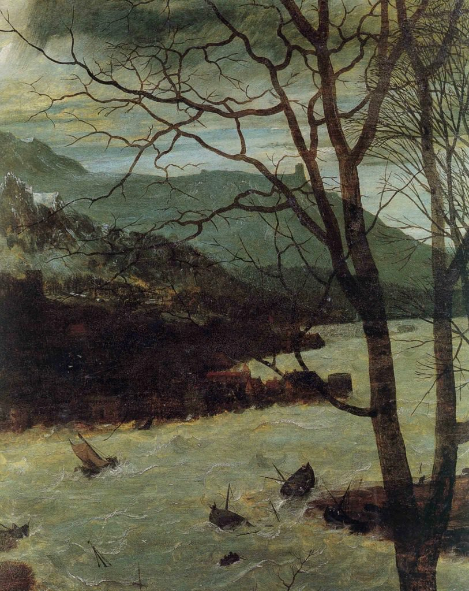

[🏠 Home](../../index.md)

# May 28

## 🧑‍🎨 Painting of the day

[Pieter Bruegel](http://en.wikipedia.org/wiki/Pieter_Bruegel_the_Elder) (Northern Renaissance)

<button class="btn btn-success"
onclick=" window.open('https://lens.google.com/uploadbyurl?url=https://iretes.github.io/one-a-day/data/img/Pieter_Bruegel_6.jpg','_blank')">
Search with Google Lens
</button>

## 🎼 Song of the day

> *When Doves Cry*
by Prince

 Written by Prince.

Released in June , 1984.

<button class="btn btn-success"
onclick=" window.open('http://www.youtube.com/search?q=When Doves Cry by Prince','_blank')">
Search on YouTube
</button>

## 🏛️ UNESCO heritage site of the day

> *Alejandro de Humboldt National Park*, Cuba

Complex geology and varied topography have given rise to a diversity of ecosystems and species unmatched in the insular Caribbean and created one of the most biologically diverse tropical island sites on earth. Many of the underlying rocks are toxic to plants so species have had to adapt to survive in these hostile conditions. This unique process of evolution has resulted in the development of many new species and the park is one of the most important sites in the Western Hemisphere for the conservation of endemic flora. Endemism of vertebrates and invertebrates is also very high.

<button class="btn btn-success"
onclick=" window.open('http://www.google.com/search?q=Alejandro de Humboldt National Park','_blank')">
Search on Google
</button>

## 🗺️ Place of the day

<iframe
src="https://www.mapcrunch.com"
name="mapcrunch"
width="500"
height="500"
allowTransparency="true"
scrolling="no"
frameborder="0"
>
</iframe>
## 🎨 Color of the day

> *[Dark liver (horses)](https://en.wikipedia.org/wiki/Liver_(color)#Dark_liver_(horses))*

&#9632;

## 🌿 Plant of the day

> *pear*

<button class="btn btn-success"
onclick=" window.open('http://www.google.com/search?q=pear','_blank')">
Search on Google
</button>

## 🧑‍🔬 Scientific discovery of the day

> *3rd century BC: Archimedes further develops the method of exhaustion into an early description of integration.*

<button class="btn btn-success"
onclick=" window.open('http://www.google.com/search?q=3rd century BC: Archimedes further develops the method of exhaustion into an early description of integration.','_blank')">
Search on Google
</button>

## 💭 Philosophical concept of the day

> *[Avant-garde](https://en.wikipedia.org/wiki/Avant-garde)*

## 🗣️ Saying of the day

> *Dog days*

The 'dog days' are the very hot days during July and August.
