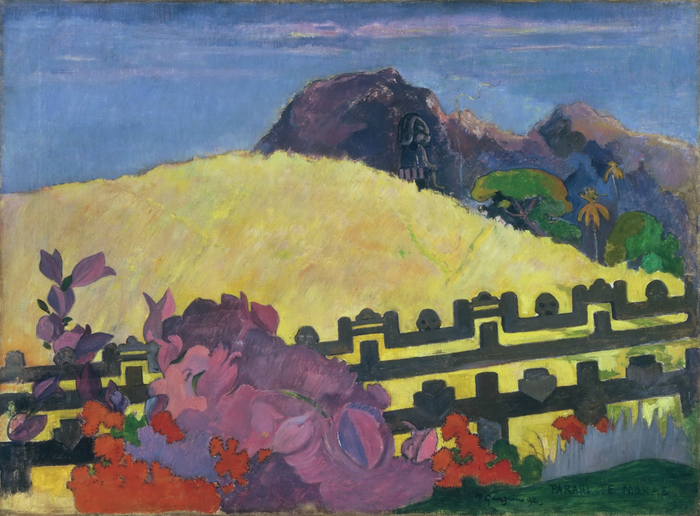

[🏠 Home](../../index.md)

# May 29

## 🧑‍🎨 Painting of the day

[Paul Gauguin](http://en.wikipedia.org/wiki/Paul_Gauguin) (Symbolism, Post-Impressionism)

<button class="btn btn-success"
onclick=" window.open('https://lens.google.com/uploadbyurl?url=https://iretes.github.io/one-a-day/data/img/Paul_Gauguin_2.jpg','_blank')">
Search with Google Lens
</button>

## 🎼 Song of the day

> *The Message*
by Grandmaster Flash and the Furious Five

 Written by Duke Bootee, Melle Mel.

Released in May , 1982.

<button class="btn btn-success"
onclick=" window.open('http://www.youtube.com/search?q=The Message by Grandmaster Flash and the Furious Five','_blank')">
Search on YouTube
</button>

## 🏛️ UNESCO heritage site of the day

> *Castles and Town Walls of King Edward in Gwynedd*, United Kingdom of Great Britain and Northern Ireland

The castles of Beaumaris and Harlech (largely the work of the greatest military engineer of the time, James of St George) and the fortified complexes of Caernarfon and Conwy are located in the former principality of Gwynedd, in north Wales. These extremely well-preserved monuments are examples of the colonization and defence works carried out throughout the reign of Edward I (1272&ndash;1307) and the military architecture of the time.

<button class="btn btn-success"
onclick=" window.open('http://www.google.com/search?q=Castles and Town Walls of King Edward in Gwynedd','_blank')">
Search on Google
</button>

## 🗺️ Place of the day

<iframe
src="https://www.mapcrunch.com"
name="mapcrunch"
width="500"
height="500"
allowTransparency="true"
scrolling="no"
frameborder="0"
>
</iframe>
## 🎨 Color of the day

> *[Coquelicot](https://en.wikipedia.org/wiki/Coquelicot)*

&#9632;

## 🌿 Plant of the day

> *blackie head*

<button class="btn btn-success"
onclick=" window.open('http://www.google.com/search?q=blackie head','_blank')">
Search on Google
</button>

## 🧑‍🔬 Scientific discovery of the day

> *2000 BC: Primitive positional notation for numerals is seen in the Babylonian cuneiform numerals. However, the lack of clarity around the notion of zero made their system highly ambiguous (e.g. 13200 would be written the same as 132).*

<button class="btn btn-success"
onclick=" window.open('http://www.google.com/search?q=2000 BC: Primitive positional notation for numerals is seen in the Babylonian cuneiform numerals. However, the lack of clarity around the notion of zero made their system highly ambiguous (e.g. 13200 would be written the same as 132).','_blank')"> 
Search on Google
</button>

## 💭 Philosophical concept of the day

> *[Being](https://en.wikipedia.org/wiki/Being)*

## 🗣️ Saying of the day

> *Daniel come to judgement*

Someone who makes a wise judgement about something that has previously proven difficult to resolve.

## 🏳️‍🌈 International day

International Day of UN Peacekeepers.