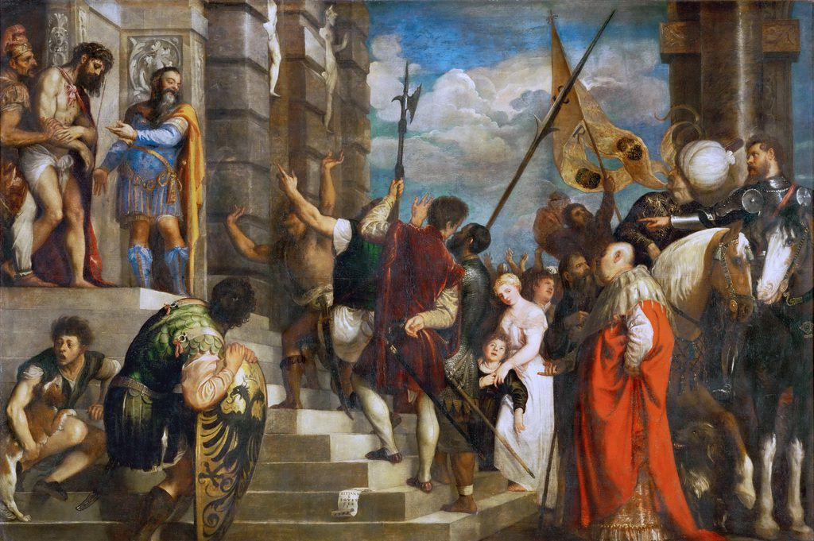

[🏠 Home](../../index.md)

# May 3

## 🧑‍🎨 Painting of the day

[Titian](http://en.wikipedia.org/wiki/Titian) (High Renaissance, Mannerism)

<button class="btn btn-success"
onclick=" window.open('https://lens.google.com/uploadbyurl?url=https://iretes.github.io/one-a-day/data/img/Titian_1.jpg','_blank')">
Search with Google Lens
</button>

## 🎼 Song of the day

> *Mystery Train*
by Elvis Presley

 Written by Junior Parker, Sam Phillips.

Released in Sept. , 1955.

<button class="btn btn-success"
onclick=" window.open('http://www.youtube.com/search?q=Mystery Train by Elvis Presley','_blank')">
Search on YouTube
</button>

## 🏛️ UNESCO heritage site of the day

> *Jongmyo Shrine*, Republic of Korea

Jongmyo is the oldest and most authentic of the Confucian royal shrines to have been preserved. Dedicated to the forefathers of the Joseon dynasty (1392–1910), the shrine has existed in its present form since the 16th century and houses tablets bearing the teachings of members of the former royal family. Ritual ceremonies linking music, song and dance still take place there, perpetuating a tradition that goes back to the 14th century.

<button class="btn btn-success"
onclick=" window.open('http://www.google.com/search?q=Jongmyo Shrine','_blank')">
Search on Google
</button>

## 🗺️ Place of the day

<iframe
src="https://www.mapcrunch.com"
name="mapcrunch"
width="500"
height="500"
allowTransparency="true"
scrolling="no"
frameborder="0"
>
</iframe>
## 🎨 Color of the day

> *[Carmine](https://en.wikipedia.org/wiki/Carmine_(color))*

&#9632;

## 🌿 Plant of the day

> *great ragweed*

<button class="btn btn-success"
onclick=" window.open('http://www.google.com/search?q=great ragweed','_blank')">
Search on Google
</button>

## 🧑‍🔬 Scientific discovery of the day

> *1947: William Shockley, John Bardeen and Walter Brattain invent the first transistor*

<button class="btn btn-success"
onclick=" window.open('http://www.google.com/search?q=1947: William Shockley, John Bardeen and Walter Brattain invent the first transistor','_blank')">
Search on Google
</button>

## 💭 Philosophical concept of the day

> *[Unobservable](https://en.wikipedia.org/wiki/Unobservable)*

## 🗣️ Saying of the day

> *Crapper - The *

The
 lavatory.

## 🏳️‍🌈 International day

World Press Freedom Day.