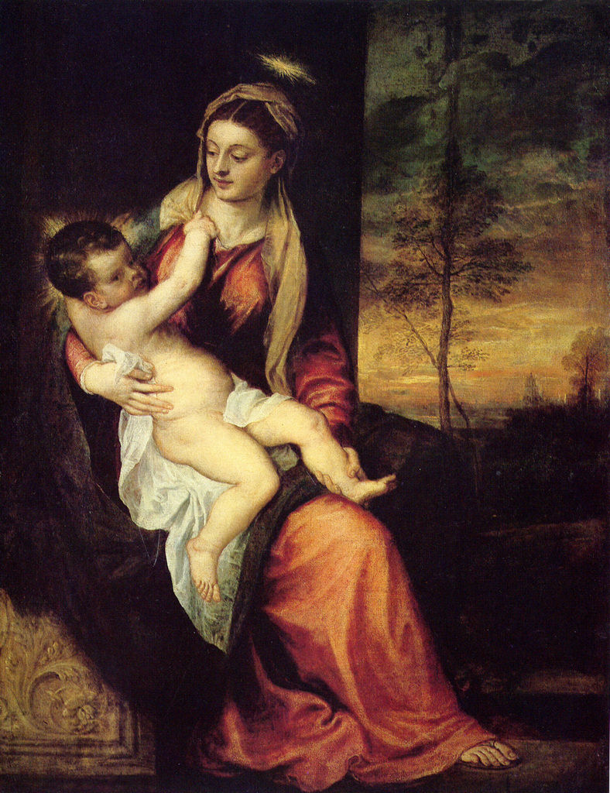

[🏠 Home](../../index.md)

# May 30

## 🧑‍🎨 Painting of the day

[Titian](http://en.wikipedia.org/wiki/Titian) (High Renaissance, Mannerism)

<button class="btn btn-success"
onclick=" window.open('https://lens.google.com/uploadbyurl?url=https://iretes.github.io/one-a-day/data/img/Titian_4.jpg','_blank')">
Search with Google Lens
</button>

## 🎼 Song of the day

> *Dont Be Cruel*
by Elvis Presley

 Written by Otis Blackwell, Presley.

Released in July , 1956.

<button class="btn btn-success"
onclick=" window.open('http://www.youtube.com/search?q=Dont Be Cruel by Elvis Presley','_blank')">
Search on YouTube
</button>

## 🏛️ UNESCO heritage site of the day

> *Cultural and Historic Ensemble of the Solovetsky Islands*, Russian Federation

The Solovetsky archipelago comprises six islands in the western part of the White Sea, covering about 300 km2 . They have been inhabited since the 5th century B.C. and important traces of a human presence from as far back as the 5th millennium B.C. can be found there. The archipelago has been the site of fervent monastic activity since the 15th century, and there are several churches dating from the 16th to the 19th century.

<button class="btn btn-success"
onclick=" window.open('http://www.google.com/search?q=Cultural and Historic Ensemble of the Solovetsky Islands','_blank')">
Search on Google
</button>

## 🗺️ Place of the day

<iframe
src="https://www.mapcrunch.com"
name="mapcrunch"
width="500"
height="500"
allowTransparency="true"
scrolling="no"
frameborder="0"
>
</iframe>
## 🎨 Color of the day

> *[Silver pink](https://en.wikipedia.org/wiki/Shades_of_pink#Silver_pink)*

&#9632;

## 🌿 Plant of the day

> *hares thistle*

<button class="btn btn-success"
onclick=" window.open('http://www.google.com/search?q=hares thistle','_blank')">
Search on Google
</button>

## 🧑‍🔬 Scientific discovery of the day

> *12th century: Bhāskara II develops the Chakravala method, solving Pell's equation.*

<button class="btn btn-success"
onclick=" window.open('http://www.google.com/search?q=12th century: Bhāskara II develops the Chakravala method, solving Pell s equation.','_blank')"> 
Search on Google
</button>

## 💭 Philosophical concept of the day

> *[Triratna](https://en.wikipedia.org/wiki/Triratna)*

## 🗣️ Saying of the day

> *Whoops-a-daisy*

An exclamation made when encouraging a child to get up after a fall or when lifting a child into the air.

## 🏳️‍🌈 International day

International Day of Potato.