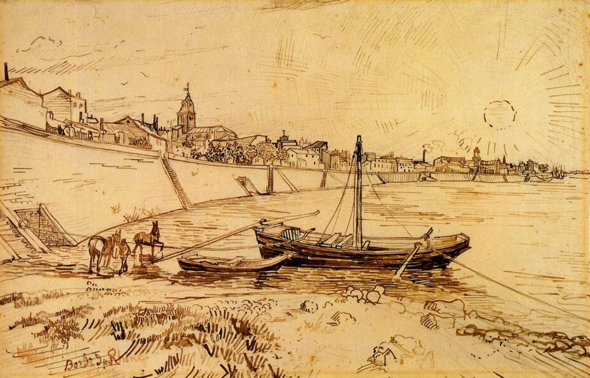

[🏠 Home](../../index.md)

# May 4

## 🧑‍🎨 Painting of the day

[Vincent van Gogh](http://en.wikipedia.org/wiki/Vincent_van_Gogh) (Post-Impressionism)

<button class="btn btn-success"
onclick=" window.open('https://lens.google.com/uploadbyurl?url=https://iretes.github.io/one-a-day/data/img/Vincent_van_Gogh_8.jpg','_blank')">
Search with Google Lens
</button>

## 🎼 Song of the day

> *Strawberry Fields Forever*
by The Beatles

 Written by John Lennon, Paul McCartney.

Released in Feb. , 1967.

<button class="btn btn-success"
onclick=" window.open('http://www.youtube.com/search?q=Strawberry Fields Forever by The Beatles','_blank')">
Search on YouTube
</button>

## 🏛️ UNESCO heritage site of the day

> *Ancient City of Aleppo*, Syrian Arab Republic

Located at the crossroads of several trade routes from the 2nd millennium B.C., Aleppo was ruled successively by the Hittites, Assyrians, Arabs, Mongols, Mamelukes and Ottomans. The 13th-century citadel, 12th-century Great Mosque and various 17th-century madrasas, palaces, caravanserais and hammams all form part of the city's cohesive, unique urban fabric, now threatened by overpopulation.

<button class="btn btn-success"
onclick=" window.open('http://www.google.com/search?q=Ancient City of Aleppo','_blank')">
Search on Google
</button>

## 🗺️ Place of the day

<iframe
src="https://www.mapcrunch.com"
name="mapcrunch"
width="500"
height="500"
allowTransparency="true"
scrolling="no"
frameborder="0"
>
</iframe>
## 🎨 Color of the day

> *[Viridian](https://en.wikipedia.org/wiki/Viridian)*

&#9632;

## 🌿 Plant of the day

> *sweet potato*

<button class="btn btn-success"
onclick=" window.open('http://www.google.com/search?q=sweet potato','_blank')">
Search on Google
</button>

## 🧑‍🔬 Scientific discovery of the day

> *1859: Charles Darwin and Alfred Wallace: Theory of evolution by natural selection.*

<button class="btn btn-success"
onclick=" window.open('http://www.google.com/search?q=1859: Charles Darwin and Alfred Wallace: Theory of evolution by natural selection.','_blank')"> 
Search on Google
</button>

## 💭 Philosophical concept of the day

> *[Kundalini energy](https://en.wikipedia.org/wiki/Kundalini_energy)*

## 🗣️ Saying of the day

> *Bunch of fives - A *

'A bunch of fives' is a slang term for
          a fist, especially one used for punching. The
          fives are the four fingers and the thumb.
