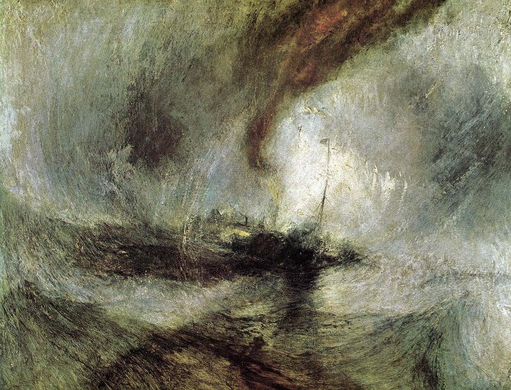

[🏠 Home](../../index.md)

# May 5

## 🧑‍🎨 Painting of the day

[William Turner](https://en.wikipedia.org/wiki/J._M._W._Turner) (Romanticism)

<button class="btn btn-success"
onclick=" window.open('https://lens.google.com/uploadbyurl?url=https://iretes.github.io/one-a-day/data/img/William_Turner_1.jpg','_blank')">
Search with Google Lens
</button>

## 🎼 Song of the day

> *Whole Lotta Love*
by Led Zeppelin

 Written by Willie Dixon, Led Zeppelin.

Released in Oct. , 1969.

<button class="btn btn-success"
onclick=" window.open('http://www.youtube.com/search?q=Whole Lotta Love by Led Zeppelin','_blank')">
Search on YouTube
</button>

## 🏛️ UNESCO heritage site of the day

> *Syracuse and the Rocky Necropolis of Pantalica*, Italy

The site consists of two separate elements, containing outstanding vestiges dating back to Greek and Roman times: The Necropolis of Pantalica contains over 5,000 tombs cut into the rock near open stone quarries, most of them dating from the 13th to 7th centuries BC. Vestiges of the Byzantine era also remain in the area, notably the foundations of the Anaktoron (Prince’s Palace). The other part of the property, Ancient Syracuse, includes the nucleus of the city’s foundation as Ortygia by Greeks from Corinth in the 8th century BC. The site of the city, which Cicero described as ‘the greatest Greek city and the most beautiful of all’, retains vestiges such as the Temple of Athena (5th century BC, later transformed to serve as a cathedral), a Greek theatre, a Roman amphitheatre, a fort and more. Many remains bear witness to the troubled history of Sicily, from the Byzantines to the Bourbons, interspersed with the Arabo-Muslims, the Normans, Frederick II of the Hohenstaufen dynasty (1197–1250), the Aragons and the Kingdom of the Two Sicilies. Historic Syracuse offers a unique testimony to the development of Mediterranean civilization over three millennia.

<button class="btn btn-success"
onclick=" window.open('http://www.google.com/search?q=Syracuse and the Rocky Necropolis of Pantalica','_blank')">
Search on Google
</button>

## 🗺️ Place of the day

<iframe
src="https://www.mapcrunch.com"
name="mapcrunch"
width="500"
height="500"
allowTransparency="true"
scrolling="no"
frameborder="0"
>
</iframe>
## 🎨 Color of the day

> *[Rhythm](https://en.wikipedia.org/wiki/Blue-gray#Rhythm)*

&#9632;

## 🌿 Plant of the day

> *white indian hemp*

<button class="btn btn-success"
onclick=" window.open('http://www.google.com/search?q=white indian hemp','_blank')">
Search on Google
</button>

## 🧑‍🔬 Scientific discovery of the day

> *1943: Oswald Avery proves that DNA is the genetic material of the chromosome*

<button class="btn btn-success"
onclick=" window.open('http://www.google.com/search?q=1943: Oswald Avery proves that DNA is the genetic material of the chromosome','_blank')"> 
Search on Google
</button>

## 💭 Philosophical concept of the day

> *[Yidam](https://en.wikipedia.org/wiki/Yidam)*

## 🗣️ Saying of the day

> *Put your nose out of joint *

Hurt your feelings or upset your plans. 

## 🏳️‍🌈 International day

World Portuguese Language Day.