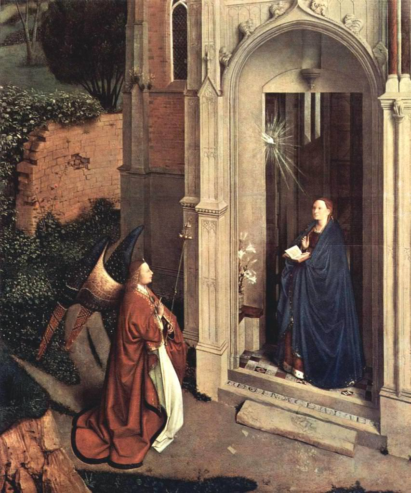

[🏠 Home](../../index.md)

# May 6

## 🧑‍🎨 Painting of the day

[Jan van Eyck](http://en.wikipedia.org/wiki/Jan_van_Eyck) (Northern Renaissance)

<button class="btn btn-success"
onclick=" window.open('https://lens.google.com/uploadbyurl?url=https://iretes.github.io/one-a-day/data/img/Jan_van_Eyck_1.jpg','_blank')">
Search with Google Lens
</button>

## 🎼 Song of the day

> *Summertime Blues*
by Eddie Cochran

 Written by Cochran, Jerry Capehart.

Released in July , 1958.

<button class="btn btn-success"
onclick=" window.open('http://www.youtube.com/search?q=Summertime Blues by Eddie Cochran','_blank')">
Search on YouTube
</button>

## 🏛️ UNESCO heritage site of the day

> *Silk Roads: the Routes Network of Chang'an-Tianshan Corridor*, China,Kazakhstan,Kyrgyzstan

This property is a 5,000 km section of the extensive Silk Roads network, stretching from Chang’an/Luoyang, the central capital of China in the Han and Tang dynasties, to the Zhetysu region of Central Asia. It took shape between the 2nd century BC and 1st century AD and remained in use until the 16th century, linking multiple civilizations and facilitating far-reaching exchanges of activities in trade, religious beliefs, scientific knowledge, technological innovation, cultural practices and the arts. The thirty-three components included in the routes network include capital cities and palace complexes of various empires and Khan kingdoms, trading settlements, Buddhist cave temples, ancient paths, posthouses, passes, beacon towers, sections of The Great Wall, fortifications, tombs and religious buildings.

<button class="btn btn-success"
onclick=" window.open('http://www.google.com/search?q=Silk Roads: the Routes Network of Chang an-Tianshan Corridor','_blank')">
Search on Google
</button>

## 🗺️ Place of the day

<iframe
src="https://www.mapcrunch.com"
name="mapcrunch"
width="500"
height="500"
allowTransparency="true"
scrolling="no"
frameborder="0"
>
</iframe>
## 🎨 Color of the day

> *[Sizzling Red](https://en.wikipedia.org/wiki/List_of_Crayola_crayon_colors#Heads_&#39;n_Tails)*

&#9632;

## 🌿 Plant of the day

> *thousand leaf*

<button class="btn btn-success"
onclick=" window.open('http://www.google.com/search?q=thousand leaf','_blank')">
Search on Google
</button>

## 🧑‍🔬 Scientific discovery of the day

> *2012: Higgs boson is discovered at CERN (confirmed to 99.999% certainty)*

<button class="btn btn-success"
onclick=" window.open('http://www.google.com/search?q=2012: Higgs boson is discovered at CERN (confirmed to 99.999% certainty)','_blank')"> 
Search on Google
</button>

## 💭 Philosophical concept of the day

> *[Peripatetic axiom](https://en.wikipedia.org/wiki/Peripatetic_axiom)*

## 🗣️ Saying of the day

> *Mind your Ps and Qs*

Be on your best behaviour; be careful of your language. 
