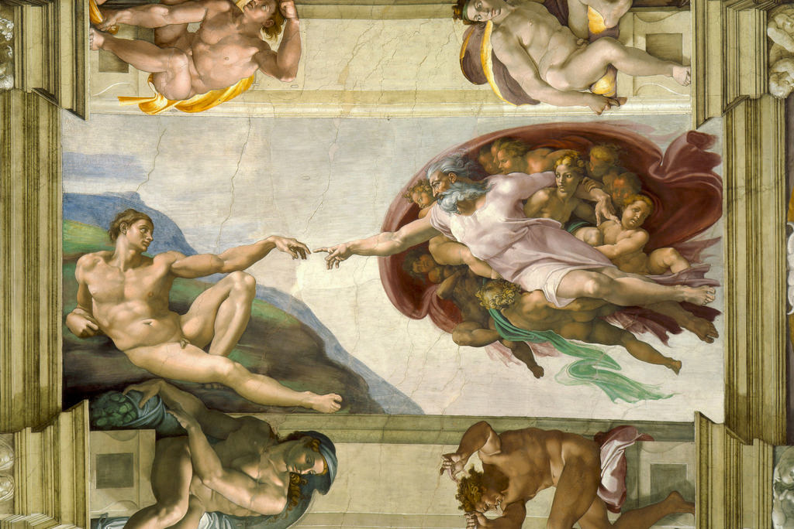

[🏠 Home](../../index.md)

# May 7

## 🧑‍🎨 Painting of the day

[Michelangelo](https://en.wikipedia.org/wiki/Michelangelo) (High Renaissance)

<button class="btn btn-success"
onclick=" window.open('https://lens.google.com/uploadbyurl?url=https://iretes.github.io/one-a-day/data/img/Michelangelo_4.jpg','_blank')">
Search with Google Lens
</button>

## 🎼 Song of the day

> *Superstition*
by Stevie Wonder

 Written by Wonder.

Released in Nov. , 1972.

<button class="btn btn-success"
onclick=" window.open('http://www.youtube.com/search?q=Superstition by Stevie Wonder','_blank')">
Search on YouTube
</button>

## 🏛️ UNESCO heritage site of the day

> *Pantanal Conservation Area*, Brazil

The Pantanal Conservation Area consists of a cluster of four protected areas with a total area of 187,818 ha. Located in western central Brazil at the south-west corner of the State of Mato Grosso, the site represents 1.3% of Brazil's Pantanal region, one of the world's largest freshwater wetland ecosystems. The headwaters of the region's two major river systems, the Cuiabá and the Paraguay rivers, are located here, and the abundance and diversity of its vegetation and animal life are spectacular.

<button class="btn btn-success"
onclick=" window.open('http://www.google.com/search?q=Pantanal Conservation Area','_blank')">
Search on Google
</button>

## 🗺️ Place of the day

<iframe
src="https://www.mapcrunch.com"
name="mapcrunch"
width="500"
height="500"
allowTransparency="true"
scrolling="no"
frameborder="0"
>
</iframe>
## 🎨 Color of the day

> *[Fire engine red](https://en.wikipedia.org/wiki/Fire_engine_red)*

&#9632;

## 🌿 Plant of the day

> *pale corydalis*

<button class="btn btn-success"
onclick=" window.open('http://www.google.com/search?q=pale corydalis','_blank')">
Search on Google
</button>

## 🧑‍🔬 Scientific discovery of the day

> *1876: Josiah Willard Gibbs founded chemical thermodynamics, the phase rule.*

<button class="btn btn-success"
onclick=" window.open('http://www.google.com/search?q=1876: Josiah Willard Gibbs founded chemical thermodynamics, the phase rule.','_blank')">
Search on Google
</button>

## 💭 Philosophical concept of the day

> *[Disgust](https://en.wikipedia.org/wiki/Disgust)*

## 🗣️ Saying of the day

> *Elementary my dear Watson*

The supposed explanation that Sherlock Holmes gave to his assistant, Dr. Watson, when explaining deductions he had made.
