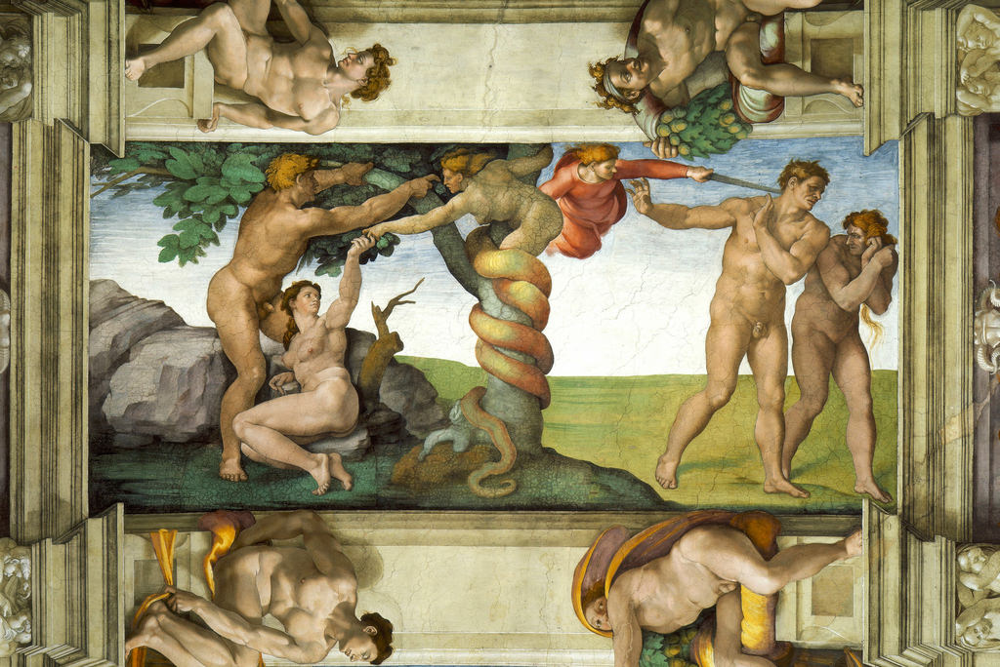

[🏠 Home](../../index.md)

# May 8

## 🧑‍🎨 Painting of the day

[Michelangelo](https://en.wikipedia.org/wiki/Michelangelo) (High Renaissance)

<button class="btn btn-success"
onclick=" window.open('https://lens.google.com/uploadbyurl?url=https://iretes.github.io/one-a-day/data/img/Michelangelo_7.jpg','_blank')">
Search with Google Lens
</button>

## 🎼 Song of the day

> *California Girls*
by The Beach Boys

 Written by Brian Wilson, Mike Love.

Released in July , 1965.

<button class="btn btn-success"
onclick=" window.open('http://www.youtube.com/search?q=California Girls by The Beach Boys','_blank')">
Search on YouTube
</button>

## 🏛️ UNESCO heritage site of the day

> *Waterton Glacier International Peace Park*, Canada,United States of America

In 1932 Waterton Lakes National Park (Alberta, Canada) was combined with the Glacier National Park (Montana, United States) to form the world's first International Peace Park. Situated on the border between the two countries and offering outstanding scenery, the park is exceptionally rich in plant and mammal species as well as prairie, forest, and alpine and glacial features.

<button class="btn btn-success"
onclick=" window.open('http://www.google.com/search?q=Waterton Glacier International Peace Park','_blank')">
Search on Google
</button>

## 🗺️ Place of the day

<iframe
src="https://www.mapcrunch.com"
name="mapcrunch"
width="500"
height="500"
allowTransparency="true"
scrolling="no"
frameborder="0"
>
</iframe>
## 🎨 Color of the day

> *[Ghost white](https://en.wikipedia.org/wiki/Shades_of_white#Ghost_white)*

&#9632;

## 🌿 Plant of the day

> *cabinet cherry*

<button class="btn btn-success"
onclick=" window.open('http://www.google.com/search?q=cabinet cherry','_blank')">
Search on Google
</button>

## 🧑‍🔬 Scientific discovery of the day

> *2022: NASA successfully launches the Artemis 1 Moon mission on the SLS spacecraft after multiple delays.*

<button class="btn btn-success"
onclick=" window.open('http://www.google.com/search?q=2022: NASA successfully launches the Artemis 1 Moon mission on the SLS spacecraft after multiple delays.','_blank')">
Search on Google
</button>

## 💭 Philosophical concept of the day

> *[Supermind](https://en.wikipedia.org/wiki/Supermind_(integral_yoga))*

## 🗣️ Saying of the day

> *Thing of beauty is a joy forever - A *

The experience of beauty is blissful and lasting.

## 🏳️‍🌈 International day

Time of Remembrance and Reconciliation for Those Who Lost Their Lives During the Second World War.