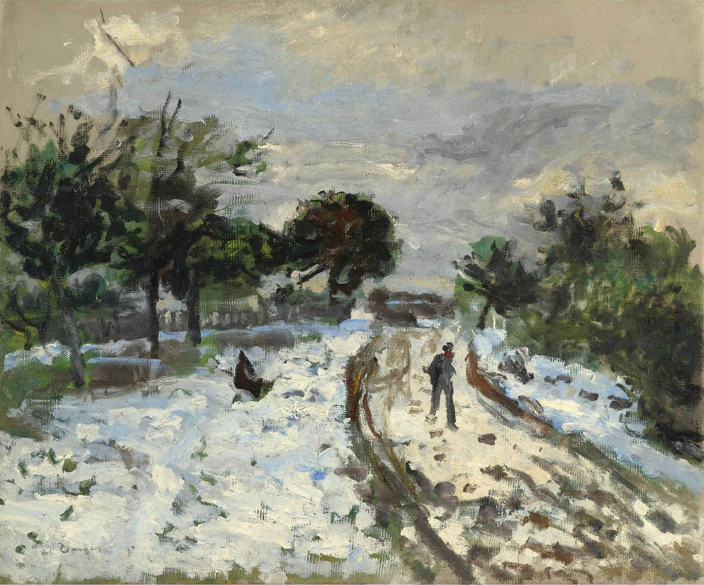

[🏠 Home](../../index.md)

# May 9

## 🧑‍🎨 Painting of the day

[Pierre-Auguste Renoir](http://en.wikipedia.org/wiki/Pierre-Auguste_Renoir) (Impressionism)

<button class="btn btn-success"
onclick=" window.open('https://lens.google.com/uploadbyurl?url=https://iretes.github.io/one-a-day/data/img/Pierre-Auguste_Renoir_1.jpg','_blank')">
Search with Google Lens
</button>

## 🎼 Song of the day

> *Papas Got A Brand New Bag*
by James Brown

 Written by Brown.

Released in July , 1966.

<button class="btn btn-success"
onclick=" window.open('http://www.youtube.com/search?q=Papas Got A Brand New Bag by James Brown','_blank')">
Search on YouTube
</button>

## 🏛️ UNESCO heritage site of the day

> *Cultural Landscape of Hawraman/Uramanat*, Iran (Islamic Republic of)

The remote and mountainous landscape of Hawraman/Uramanat bears testimony to the traditional culture of the Hawrami people, an agropastoral Kurdish tribe that has inhabited the region since about 3000 BCE. The property, at the heart of the Zagros Mountains in the provinces of Kurdistan and Kermanshah along the western border of Iran, encompasses two components: the Central-Eastern Valley (Zhaverud and Takht, in Kurdistan Province); and the Western Valley (Lahun, in Kermanshah Province). The mode of human habitation in these two valleys has been adapted over millennia to the rough mountainous environment. Tiered steep-slope planning and architecture, gardening on dry-stone terraces, livestock breeding, and seasonal vertical migration are among the distinctive features of the local culture and life of the semi-nomadic Hawrami people who dwell in lowlands and highlands during different seasons of each year. Their uninterrupted presence in the landscape, which is also characterized by exceptional biodiversity and endemism, is evidenced by stone tools, caves and rock shelters, mounds, remnants of permanent and temporary settlement sites, and workshops, cemeteries, roads, villages, castles, and more. The 12 villages included in the property illustrate the Hawrami people’s evolving responses to the scarcity of productive land in their mountainous environment through the millennia. 

<button class="btn btn-success"
onclick=" window.open('http://www.google.com/search?q=Cultural Landscape of Hawraman/Uramanat','_blank')">
Search on Google
</button>

## 🗺️ Place of the day

<iframe
src="https://www.mapcrunch.com"
name="mapcrunch"
width="500"
height="500"
allowTransparency="true"
scrolling="no"
frameborder="0"
>
</iframe>
## 🎨 Color of the day

> *[Maroon (web)](https://en.wikipedia.org/wiki/Maroon)*

&#9632;

## 🌿 Plant of the day

> *thousand seal*

<button class="btn btn-success"
onclick=" window.open('http://www.google.com/search?q=thousand seal','_blank')">
Search on Google
</button>

## 🧑‍🔬 Scientific discovery of the day

> *1967: Jocelyn Bell Burnell and Antony Hewish discover first pulsar*

<button class="btn btn-success"
onclick=" window.open('http://www.google.com/search?q=1967: Jocelyn Bell Burnell and Antony Hewish discover first pulsar','_blank')"> 
Search on Google
</button>

## 💭 Philosophical concept of the day

> *[Categorization](https://en.wikipedia.org/wiki/Categorization)*

## 🗣️ Saying of the day

> *To the nth degree *

To the utmost degree; without limit.
