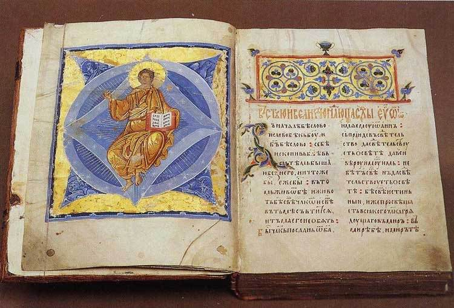

[🏠 Home](../../index.md)

# November 1

## 🧑‍🎨 Painting of the day

[Andrei Rublev](http://en.wikipedia.org/wiki/Andrei_Rublev) (Byzantine Art)

<button class="btn btn-success"
onclick=" window.open('https://lens.google.com/uploadbyurl?url=https://iretes.github.io/one-a-day/data/img/Andrei_Rublev_7.jpg','_blank')">
Search with Google Lens
</button>

## 🎼 Song of the day

> *Beautiful Day*
by U2

 Written by U2.

Released in Oct. , 2000.

<button class="btn btn-success"
onclick=" window.open('http://www.youtube.com/search?q=Beautiful Day by U2','_blank')">
Search on YouTube
</button>

## 🏛️ UNESCO heritage site of the day

> *University of Coimbra – Alta and Sofia*, Portugal

Situated on a hill overlooking the city, the University of Coimbra with its colleges grew and evolved over more than seven centuries within the old town. Notable university buildings include the 12th century Cathedral of Santa Cruz and a number of 16th century colleges,  the Royal Palace of Alcáçova, which has housed the University since 1537, the Joanine Library with its rich baroque decor, the 18th century Botanical Garden and University Press, as well as the large “University City” created during the 1940s. The University’s edifices became a reference in the development of other institutions of higher education in the Portuguese-speaking world where it also exerted a major influence on learning and literature. Coimbra offers an outstanding example of an integrated university city with a specific urban typology as well as its own ceremonial and cultural traditions that have been kept alive through the ages.

<button class="btn btn-success"
onclick=" window.open('http://www.google.com/search?q=University of Coimbra – Alta and Sofia','_blank')">
Search on Google
</button>

## 🗺️ Place of the day

<iframe
src="https://www.mapcrunch.com"
name="mapcrunch"
width="500"
height="500"
allowTransparency="true"
scrolling="no"
frameborder="0"
>
</iframe>
## 🎨 Color of the day

> *[Persian blue](https://en.wikipedia.org/wiki/Persian_blue)*

&#9632;

## 🌿 Plant of the day

> *california thistle*

<button class="btn btn-success"
onclick=" window.open('http://www.google.com/search?q=california thistle','_blank')">
Search on Google
</button>

## 🧑‍🔬 Scientific discovery of the day

> *150: Ptolemy's Almagest contains practical formulae to calculate latitudes and day lengths.*

<button class="btn btn-success"
onclick=" window.open('http://www.google.com/search?q=150: Ptolemy s Almagest contains practical formulae to calculate latitudes and day lengths.','_blank')"> 
Search on Google
</button>

## 💭 Philosophical concept of the day

> *[Chaitanya](https://en.wikipedia.org/wiki/Chaitanya_(consciousness))*

## 🗣️ Saying of the day

> *Godfrey Daniel*

God damn them.
