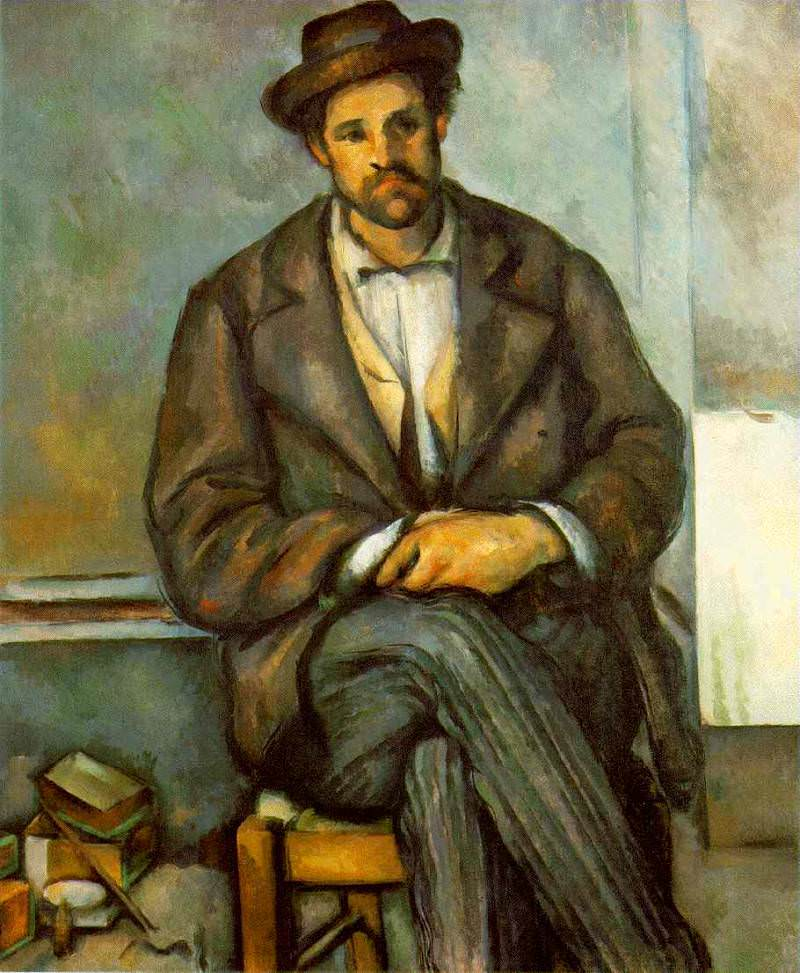

[🏠 Home](../../index.md)

# November 10

## 🧑‍🎨 Painting of the day

[Paul Cezanne](https://en.wikipedia.org/wiki/Paul_Cézanne) (Post-Impressionism)

<button class="btn btn-success"
onclick=" window.open('https://lens.google.com/uploadbyurl?url=https://iretes.github.io/one-a-day/data/img/Paul_Cezanne_6.jpg','_blank')">
Search with Google Lens
</button>

## 🎼 Song of the day

> *The End*
by The Doors

 Written by John Densmore, Robbie Krieger, Ray Manzarek, Jim Morrison.

Released in March , 1967.

<button class="btn btn-success"
onclick=" window.open('http://www.youtube.com/search?q=The End by The Doors','_blank')">
Search on YouTube
</button>

## 🏛️ UNESCO heritage site of the day

> *Tombs of Buganda Kings at Kasubi*, Uganda

The Tombs of Buganda Kings at Kasubi constitute a site embracing almost 30 ha of hillside within Kampala district. Most of the site is agricultural, farmed by traditional methods. At its core on the hilltop is the former palace of the Kabakas of Buganda, built in 1882 and converted into the royal burial ground in 1884. Four royal tombs now lie within the Muzibu Azaala Mpanga, the main building, which is circular and surmounted by a dome. It is a major example of an architectural achievement in organic materials, principally wood, thatch, reed, wattle and daub. The site's main significance lies, however, in its intangible values of belief, spirituality, continuity and identity.

<button class="btn btn-success"
onclick=" window.open('http://www.google.com/search?q=Tombs of Buganda Kings at Kasubi','_blank')">
Search on Google
</button>

## 🗺️ Place of the day

<iframe
src="https://www.mapcrunch.com"
name="mapcrunch"
width="500"
height="500"
allowTransparency="true"
scrolling="no"
frameborder="0"
>
</iframe>
## 🎨 Color of the day

> *[Eggplant](https://en.wikipedia.org/wiki/Eggplant_(color))*

&#9632;

## 🌿 Plant of the day

> *american dogwood*

<button class="btn btn-success"
onclick=" window.open('http://www.google.com/search?q=american dogwood','_blank')">
Search on Google
</button>

## 🧑‍🔬 Scientific discovery of the day

> *2020: NASA and SOFIA (Stratospheric Observatory for Infrared Astronomy) discovered about 12oz of surface water in one of the Moon's largest visible craters.*

<button class="btn btn-success"
onclick=" window.open('http://www.google.com/search?q=2020: NASA and SOFIA (Stratospheric Observatory for Infrared Astronomy) discovered about 12oz of surface water in one of the Moon s largest visible craters.','_blank')"> 
Search on Google
</button>

## 💭 Philosophical concept of the day

> *[Aufheben](https://en.wikipedia.org/wiki/Aufheben)*

## 🗣️ Saying of the day

> *Fall off the back of a lorry*

A euphemism for 'acquired illegally'.

## 🏳️‍🌈 International day

World Science Day for Peace and Development.