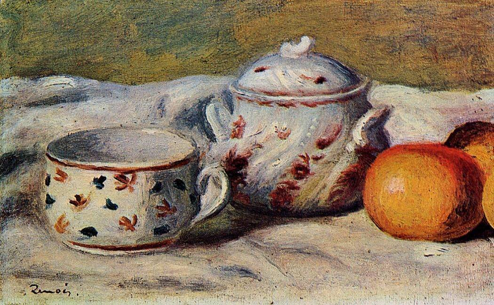

[🏠 Home](../../index.md)

# November 11

## 🧑‍🎨 Painting of the day

[Pierre-Auguste Renoir](http://en.wikipedia.org/wiki/Pierre-Auguste_Renoir) (Impressionism)

<button class="btn btn-success"
onclick=" window.open('https://lens.google.com/uploadbyurl?url=https://iretes.github.io/one-a-day/data/img/Pierre-Auguste_Renoir_3.jpg','_blank')">
Search with Google Lens
</button>

## 🎼 Song of the day

> *For Your Precious Love*
by Jerry Butler and The Impressions

 Written by Arthur Brooks, Butler.

Released in June , 1958.

<button class="btn btn-success"
onclick=" window.open('http://www.youtube.com/search?q=For Your Precious Love by Jerry Butler and The Impressions','_blank')">
Search on YouTube
</button>

## 🏛️ UNESCO heritage site of the day

> *Getbol, Korean Tidal Flats*, Republic of Korea

Situated in the eastern Yellow Sea on the southwestern and southern coast of the Republic of Korea, the site comprises four component parts: Seocheon Getbol, Gochang Getbol, Shinan Getbol and Boseong-Suncheon Getbol. The site exhibits a complex combination of geological, oceanographic and climatologic conditions that have led to the development of coastal diverse sedimentary systems. Each component represents one of four tidal flat subtypes (estuarine type, open embayed type, archipelago type and semi-enclosed type). The site hosts high levels of biodiversity, with reports of 2,150 species of flora and fauna, including 22 globally threatened or near-threatened species. It is home to 47 endemic and five endangered marine invertebrate species besides a total of 118 migratory bird species for which the site provides critical habitats. Endemic fauna includes Mud Octopuses (Octopus minor), and deposit feeders like Japanese Mud Crabs (Macrophthalmus japonica), Fiddler Crabs (Uca lactea), and Polychaetes (bristle worms), Stimpson’s Ghost Crabs (Ocypode stimpsoni), Yellow Sea Sand Snails (Umbonium thomasi), , as well as various suspension feeders like clams. The site demonstrates the link between geodiversity and biodiversity, and demonstrates the dependence of cultural diversity and human activity on the natural environment.

<button class="btn btn-success"
onclick=" window.open('http://www.google.com/search?q=Getbol, Korean Tidal Flats','_blank')">
Search on Google
</button>

## 🗺️ Place of the day

<iframe
src="https://www.mapcrunch.com"
name="mapcrunch"
width="500"
height="500"
allowTransparency="true"
scrolling="no"
frameborder="0"
>
</iframe>
## 🎨 Color of the day

> *[Irresistible](https://en.wikipedia.org/wiki/Cerise_(color)#Irresistible)*

&#9632;

## 🌿 Plant of the day

> *juniper*

<button class="btn btn-success"
onclick=" window.open('http://www.google.com/search?q=juniper','_blank')">
Search on Google
</button>

## 🧑‍🔬 Scientific discovery of the day

> *1896: Henri Becquerel discovers radioactivity*

<button class="btn btn-success"
onclick=" window.open('http://www.google.com/search?q=1896: Henri Becquerel discovers radioactivity','_blank')"> 
Search on Google
</button>

## 💭 Philosophical concept of the day

> *[Information](https://en.wikipedia.org/wiki/Information)*

## 🗣️ Saying of the day

> *Not for all the tea in China*

Not at any price.
