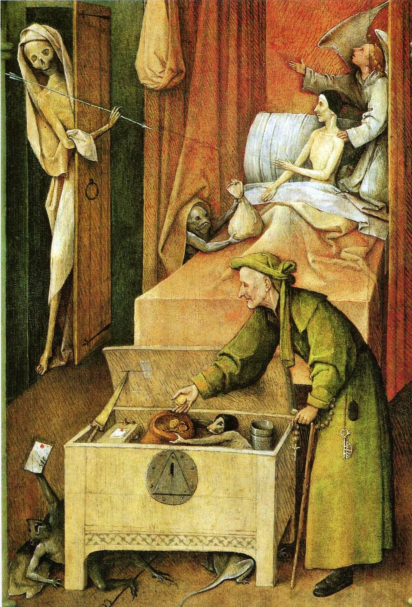

[🏠 Home](../../index.md)

# November 13

## 🧑‍🎨 Painting of the day

[Hieronymus Bosch](http://en.wikipedia.org/wiki/Hieronymus_Bosch) (Northern Renaissance)

<button class="btn btn-success"
onclick=" window.open('https://lens.google.com/uploadbyurl?url=https://iretes.github.io/one-a-day/data/img/Hieronymus_Bosch_1.jpg','_blank')">
Search with Google Lens
</button>

## 🎼 Song of the day

> *Good Lovin*
by The Young Rascals

 Written by Rudy Clark, Arthur Resnick.

Released in March , 1966.

<button class="btn btn-success"
onclick=" window.open('http://www.youtube.com/search?q=Good Lovin by The Young Rascals','_blank')">
Search on YouTube
</button>

## 🏛️ UNESCO heritage site of the day

> *Sinharaja Forest Reserve*, Sri Lanka

Located in south-west Sri Lanka, Sinharaja is the country's last viable area of primary tropical rainforest. More than 60% of the trees are endemic and many of them are considered rare. There is much endemic wildlife, especially birds, but the reserve is also home to over 50% of Sri Lanka's endemic species of mammals and butterflies, as well as many kinds of insects, reptiles and rare amphibians.

<button class="btn btn-success"
onclick=" window.open('http://www.google.com/search?q=Sinharaja Forest Reserve','_blank')">
Search on Google
</button>

## 🗺️ Place of the day

<iframe
src="https://www.mapcrunch.com"
name="mapcrunch"
width="500"
height="500"
allowTransparency="true"
scrolling="no"
frameborder="0"
>
</iframe>
## 🎨 Color of the day

> *[Yellow (process)](https://en.wikipedia.org/wiki/Shades_of_yellow#Yellow_(CMYK)_(process_yellow)_(canary_yellow))*

&#9632;

## 🌿 Plant of the day

> *wild rose*

<button class="btn btn-success"
onclick=" window.open('http://www.google.com/search?q=wild rose','_blank')">
Search on Google
</button>

## 🧑‍🔬 Scientific discovery of the day

> *11th century: Alhazen systematically studies optics and refraction, which would later be important in making the connection between geometric (ray) optics and wave theory.*

<button class="btn btn-success"
onclick=" window.open('http://www.google.com/search?q=11th century: Alhazen systematically studies optics and refraction, which would later be important in making the connection between geometric (ray) optics and wave theory.','_blank')">
Search on Google
</button>

## 💭 Philosophical concept of the day

> *[Sahaja](https://en.wikipedia.org/wiki/Sahaja)*

## 🗣️ Saying of the day

> *The usual suspects*

"The usual suspects" are the people habitually suspected or arrested following a crime. 
