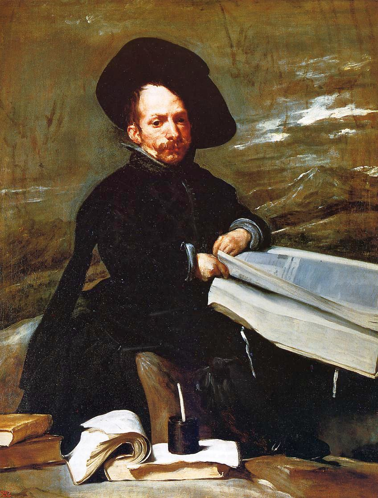

[🏠 Home](../../index.md)

# November 14

## 🧑‍🎨 Painting of the day

[Diego Velazquez](http://en.wikipedia.org/wiki/Diego_Velázquez) (Baroque)

<button class="btn btn-success"
onclick=" window.open('https://lens.google.com/uploadbyurl?url=https://iretes.github.io/one-a-day/data/img/Diego_Velazquez_1.jpg','_blank')">
Search with Google Lens
</button>

## 🎼 Song of the day

> *Baby Love*
by The Supremes

 Written by Brian Holland,Lamont Dozier, Eddie Holland.

Released in Sept. , 1964.

<button class="btn btn-success"
onclick=" window.open('http://www.youtube.com/search?q=Baby Love by The Supremes','_blank')">
Search on YouTube
</button>

## 🏛️ UNESCO heritage site of the day

> *Cahokia Mounds State Historic Site*, United States of America

Cahokia Mounds, some 13 km north-east of St Louis, Missouri, is the largest pre-Columbian settlement north of Mexico. It was occupied primarily during the Mississippian period (800–1400), when it covered nearly 1,600 ha and included some 120 mounds. It is a striking example of a complex chiefdom society, with many satellite mound centres and numerous outlying hamlets and villages. This agricultural society may have had a population of 10–20,000 at its peak between 1050 and 1150. Primary features at the site include Monks Mound, the largest prehistoric earthwork in the Americas, covering over 5 ha and standing 30 m high.

<button class="btn btn-success"
onclick=" window.open('http://www.google.com/search?q=Cahokia Mounds State Historic Site','_blank')">
Search on Google
</button>

## 🗺️ Place of the day

<iframe
src="https://www.mapcrunch.com"
name="mapcrunch"
width="500"
height="500"
allowTransparency="true"
scrolling="no"
frameborder="0"
>
</iframe>
## 🎨 Color of the day

> *[Lime (web) (X11 green)](https://en.wikipedia.org/wiki/Lime_(color)#Web_color_&quot;lime&quot;_(X11_Green))*

&#9632;

## 🌿 Plant of the day

> *screw bean mesquite*

<button class="btn btn-success"
onclick=" window.open('http://www.google.com/search?q=screw bean mesquite','_blank')">
Search on Google
</button>

## 🧑‍🔬 Scientific discovery of the day

> *16th century: François Viète discovers Viète's formula for π.*

<button class="btn btn-success"
onclick=" window.open('http://www.google.com/search?q=16th century: François Viète discovers Viète s formula for π.','_blank')">
Search on Google
</button>

## 💭 Philosophical concept of the day

> *[Shabda](https://en.wikipedia.org/wiki/Shabda)*

## 🗣️ Saying of the day

> *As fast as greased lightning*

Very fast.

## 🏳️‍🌈 International day

World Diabetes Day.